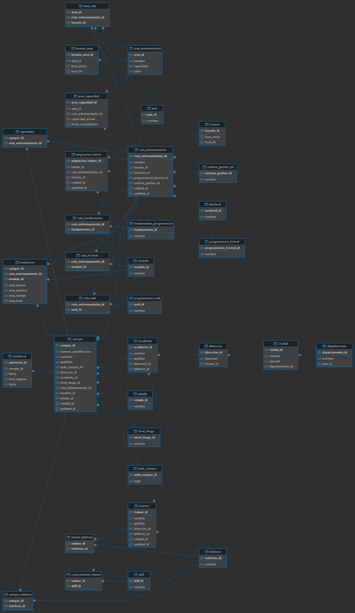

## Índice
1. [Consultas SQL](#consultas-sql)
   - [Campers](#campers)
   - [Evaluaciones](#evaluaciones)
   - [Rutas y Áreas de Entrenamiento](#rutas-y-áreas-de-entrenamiento)
   - [Trainers](#trainers)
   - [Consultas con Subconsultas y Cálculos Avanzados](#consultas-con-subconsultas-y-cálculos-avanzados)
   - [JOINs Básicos](#joins-básicos)
   - [JOINs con condiciones específicas](#joins-con-condiciones-específicas)
   - [JOINs con funciones de agregación](#joins-con-funciones-de-agregación)
2. [Procedimientos Almacenados](#procedimientos-almacenados)
3. [Funciones SQL](#funciones-sql)
4. [Triggers SQL](#triggers-sql)
5. [Insert](#insert)

**BASE DE DATOS**

# CampusLands Database



```mysql
DROP DATABASE IF EXISTS dbcampuslands;
CREATE DATABASE dbcampuslands;
USE dbcampuslands;

CREATE TABLE sede_campus (
    sede_campus_id INT PRIMARY KEY AUTO_INCREMENT,
    lugar VARCHAR(50)
) ENGINE=InnoDB;

CREATE TABLE nivel_riesgo (
    nivel_riesgo_id INT PRIMARY KEY AUTO_INCREMENT,
    nombre VARCHAR(15)
) ENGINE=InnoDB;

CREATE TABLE telefono (
    telefono_id INT PRIMARY KEY AUTO_INCREMENT,
    numero VARCHAR(15)
) ENGINE=InnoDB;

CREATE TABLE backend (
    backend_id INT PRIMARY KEY AUTO_INCREMENT,
    nombre VARCHAR(50)
) ENGINE=InnoDB;

CREATE TABLE sistema_gestion_bd (
    sistema_gestion_id INT PRIMARY KEY AUTO_INCREMENT,
    nombre VARCHAR(50)
) ENGINE=InnoDB;

CREATE TABLE programacion_formal (
    programacion_formal_id INT PRIMARY KEY AUTO_INCREMENT,
    nombre VARCHAR(50)
) ENGINE=InnoDB;

CREATE TABLE estado (
    estado_id INT PRIMARY KEY AUTO_INCREMENT,
    nombre VARCHAR(20)
) ENGINE=InnoDB;

CREATE TABLE modulo (
    modulo_id INT PRIMARY KEY AUTO_INCREMENT,
    nombre VARCHAR(50)
) ENGINE=InnoDB;

CREATE TABLE horario (
    horario_id INT PRIMARY KEY AUTO_INCREMENT,
    hora_inicio TIME,
    hora_fin TIME
) ENGINE=InnoDB;

CREATE TABLE skill (
    skill_id INT PRIMARY KEY AUTO_INCREMENT,
    nombre VARCHAR(50)
) ENGINE=InnoDB;

CREATE TABLE departamento (
    departamento_id INT PRIMARY KEY AUTO_INCREMENT,
    nombre VARCHAR(50),
    pais_id INT
) ENGINE=InnoDB;

CREATE TABLE fundamentos_programacion (
    fundamentos_id INT PRIMARY KEY AUTO_INCREMENT,
    nombre VARCHAR(50)
) ENGINE=InnoDB;

CREATE TABLE programacion_web (
    web_id INT PRIMARY KEY AUTO_INCREMENT,
    nombre VARCHAR(50)
) ENGINE=InnoDB;

CREATE TABLE area_entrenamiento (
    area_id INT PRIMARY KEY AUTO_INCREMENT,
    nombre VARCHAR(50) NOT NULL,
    capacidad INT DEFAULT 33,
    salon VARCHAR(50)
) ENGINE=InnoDB;

CREATE TABLE ciudad (
    ciudad_id INT PRIMARY KEY AUTO_INCREMENT,
    nombre VARCHAR(50),
    zipcode VARCHAR(10),
    departamento_id INT,
    FOREIGN KEY (departamento_id) REFERENCES departamento(departamento_id)
) ENGINE=InnoDB;

CREATE TABLE direccion (
    direccion_id INT PRIMARY KEY AUTO_INCREMENT,
    direccion VARCHAR(100),
    ciudad_id INT,
    FOREIGN KEY (ciudad_id) REFERENCES ciudad(ciudad_id)
) ENGINE=InnoDB;

CREATE TABLE ruta_entrenamiento (
    ruta_entrenamiento_id INT PRIMARY KEY AUTO_INCREMENT,
    nombre VARCHAR(50) NOT NULL,
    horario_id INT,
    backend_id INT,
    programacion_formal_id INT,
    sistema_gestion_id INT,
    sistema_gestion_alternativo_id INT,
    created_at TIMESTAMP DEFAULT CURRENT_TIMESTAMP,
    updated_at TIMESTAMP DEFAULT CURRENT_TIMESTAMP ON UPDATE CURRENT_TIMESTAMP,
    FOREIGN KEY (horario_id) REFERENCES horario(horario_id),
    FOREIGN KEY (backend_id) REFERENCES backend(backend_id),
    FOREIGN KEY (programacion_formal_id) REFERENCES programacion_formal(programacion_formal_id),
    FOREIGN KEY (sistema_gestion_id) REFERENCES sistema_gestion_bd(sistema_gestion_id),
    FOREIGN KEY (sistema_gestion_alternativo_id) REFERENCES sistema_gestion_bd(sistema_gestion_id)
) ENGINE=InnoDB;

CREATE TABLE acudiente (
    acudiente_id INT PRIMARY KEY AUTO_INCREMENT,
    nombre VARCHAR(50),
    apellido VARCHAR(50),
    direccion_id INT,
    telefono_id INT,
    FOREIGN KEY (direccion_id) REFERENCES direccion(direccion_id),
    FOREIGN KEY (telefono_id) REFERENCES telefono(telefono_id)
) ENGINE=InnoDB;

CREATE TABLE camper (
    camper_id INT PRIMARY KEY AUTO_INCREMENT,
    numero_identificacion VARCHAR(20) UNIQUE NOT NULL,
    nombres VARCHAR(50) NOT NULL,
    apellidos VARCHAR(50) NOT NULL,
    sede_campus_id INT,
    direccion_id INT,
    acudiente_id INT,
    nivel_riesgo_id INT,
    ruta_entrenamiento_id INT,
    modulo_id INT,
    estado_id INT,
    created_at TIMESTAMP DEFAULT CURRENT_TIMESTAMP,
    updated_at TIMESTAMP DEFAULT CURRENT_TIMESTAMP ON UPDATE CURRENT_TIMESTAMP,
    FOREIGN KEY (estado_id) REFERENCES estado(estado_id),
    FOREIGN KEY (sede_campus_id) REFERENCES sede_campus(sede_campus_id),
    FOREIGN KEY (direccion_id) REFERENCES direccion(direccion_id),
    FOREIGN KEY (acudiente_id) REFERENCES acudiente(acudiente_id),
    FOREIGN KEY (nivel_riesgo_id) REFERENCES nivel_riesgo(nivel_riesgo_id),
    FOREIGN KEY (ruta_entrenamiento_id) REFERENCES ruta_entrenamiento(ruta_entrenamiento_id),
    FOREIGN KEY (modulo_id) REFERENCES modulo(modulo_id)
) ENGINE=InnoDB;

CREATE TABLE camper_telefono (
    camper_id INT,
    telefono_id INT,
    PRIMARY KEY (camper_id, telefono_id),
    FOREIGN KEY (camper_id) REFERENCES camper(camper_id),
    FOREIGN KEY (telefono_id) REFERENCES telefono(telefono_id)
) ENGINE=InnoDB;

CREATE TABLE trainers (
    trainer_id INT PRIMARY KEY AUTO_INCREMENT,
    nombre VARCHAR(50),
    apellido VARCHAR(50),
    direccion_id INT,
    telefono_id INT,
    created_at TIMESTAMP DEFAULT CURRENT_TIMESTAMP,
    updated_at TIMESTAMP DEFAULT CURRENT_TIMESTAMP ON UPDATE CURRENT_TIMESTAMP,
    FOREIGN KEY (direccion_id) REFERENCES direccion(direccion_id),
    FOREIGN KEY (telefono_id) REFERENCES telefono(telefono_id)
) ENGINE=InnoDB;

CREATE TABLE trainer_telefono (
    trainer_id INT,
    telefono_id INT,
    PRIMARY KEY (trainer_id, telefono_id),
    FOREIGN KEY (trainer_id) REFERENCES trainers(trainer_id),
    FOREIGN KEY (telefono_id) REFERENCES telefono(telefono_id)
) ENGINE=InnoDB;

CREATE TABLE conocimiento_trainer (
    trainer_id INT,
    skill_id INT,
    PRIMARY KEY (trainer_id, skill_id),
    FOREIGN KEY (trainer_id) REFERENCES trainers(trainer_id),
    FOREIGN KEY (skill_id) REFERENCES skill(skill_id)
) ENGINE=InnoDB;

CREATE TABLE asignacion_trainer (
    asignacion_trainer_id INT PRIMARY KEY AUTO_INCREMENT,
    trainer_id INT,
    ruta_entrenamiento_id INT,
    horario_id INT,
    created_at TIMESTAMP DEFAULT CURRENT_TIMESTAMP,
    updated_at TIMESTAMP DEFAULT CURRENT_TIMESTAMP ON UPDATE CURRENT_TIMESTAMP,
    FOREIGN KEY (trainer_id) REFERENCES trainers(trainer_id),
    FOREIGN KEY (ruta_entrenamiento_id) REFERENCES ruta_entrenamiento(ruta_entrenamiento_id),
    FOREIGN KEY (horario_id) REFERENCES horario(horario_id)
) ENGINE=InnoDB;

CREATE TABLE ruta_modulo (
    ruta_entrenamiento_id INT,
    modulo_id INT,
    PRIMARY KEY (ruta_entrenamiento_id, modulo_id),
    FOREIGN KEY (ruta_entrenamiento_id) REFERENCES ruta_entrenamiento(ruta_entrenamiento_id),
    FOREIGN KEY (modulo_id) REFERENCES modulo(modulo_id)
) ENGINE=InnoDB;

CREATE TABLE horario_area (
    horario_area_id INT PRIMARY KEY AUTO_INCREMENT,
    area_id INT,
    hora_inicio TIME,
    hora_fin TIME,
    FOREIGN KEY (area_id) REFERENCES area_entrenamiento(area_id)
) ENGINE=InnoDB;

CREATE TABLE asistencia (
    asistencia_id INT PRIMARY KEY AUTO_INCREMENT,
    camper_id INT,
    fecha DATE,
    hora_ingreso TIME,
    turno ENUM('Mañana', 'Tarde'),
    FOREIGN KEY (camper_id) REFERENCES camper(camper_id)
) ENGINE=InnoDB;

CREATE TABLE egresados (
    camper_id INT,
    ruta_entrenamiento_id INT,
    PRIMARY KEY (camper_id, ruta_entrenamiento_id),
    FOREIGN KEY (camper_id) REFERENCES camper(camper_id),
    FOREIGN KEY (ruta_entrenamiento_id) REFERENCES ruta_entrenamiento(ruta_entrenamiento_id)
) ENGINE=InnoDB;

CREATE TABLE evaluacion (
    camper_id INT,
    ruta_entrenamiento_id INT,
    modulo_id INT,
    nota_teorica DECIMAL(5,2),
    nota_practica DECIMAL(5,2),
    nota_trabajo DECIMAL(5,2),
    nota_final DECIMAL(5,2),
    PRIMARY KEY (camper_id, ruta_entrenamiento_id, modulo_id),
    FOREIGN KEY (camper_id) REFERENCES camper(camper_id),
    FOREIGN KEY (ruta_entrenamiento_id) REFERENCES ruta_entrenamiento(ruta_entrenamiento_id),
    FOREIGN KEY (modulo_id) REFERENCES modulo(modulo_id),
    CHECK (nota_teorica BETWEEN 0 AND 100),
    CHECK (nota_practica BETWEEN 0 AND 100),
    CHECK (nota_trabajo BETWEEN 0 AND 100),
    CHECK (nota_final BETWEEN 0 AND 100)
) ENGINE=InnoDB;

CREATE TABLE ruta_fundamentos (
    ruta_entrenamiento_id INT,
    fundamentos_id INT,
    PRIMARY KEY (ruta_entrenamiento_id, fundamentos_id),
    FOREIGN KEY (ruta_entrenamiento_id) REFERENCES ruta_entrenamiento(ruta_entrenamiento_id),
    FOREIGN KEY (fundamentos_id) REFERENCES fundamentos_programacion(fundamentos_id)
) ENGINE=InnoDB;

CREATE TABLE ruta_web (
    ruta_entrenamiento_id INT,
    web_id INT,
    PRIMARY KEY (ruta_entrenamiento_id, web_id),
    FOREIGN KEY (ruta_entrenamiento_id) REFERENCES ruta_entrenamiento(ruta_entrenamiento_id),
    FOREIGN KEY (web_id) REFERENCES programacion_web(web_id)
) ENGINE=InnoDB;

CREATE TABLE area_capacidad (
    area_capacidad_id INT PRIMARY KEY AUTO_INCREMENT,
    area_id INT,
    ruta_entrenamiento_id INT,
    capacidad_actual INT DEFAULT 0,
    fecha_actualizacion TIMESTAMP DEFAULT CURRENT_TIMESTAMP,
    FOREIGN KEY (area_id) REFERENCES area_entrenamiento(area_id),
    FOREIGN KEY (ruta_entrenamiento_id) REFERENCES ruta_entrenamiento(ruta_entrenamiento_id),
    CHECK (capacidad_actual <= 33)
) ENGINE=InnoDB;

CREATE TABLE area_ruta (
    area_id INT,
    ruta_entrenamiento_id INT,
    horario_id INT,
    PRIMARY KEY (area_id, ruta_entrenamiento_id, horario_id),
    FOREIGN KEY (area_id) REFERENCES area_entrenamiento(area_id),
    FOREIGN KEY (ruta_entrenamiento_id) REFERENCES ruta_entrenamiento(ruta_entrenamiento_id),
    FOREIGN KEY (horario_id) REFERENCES horario(horario_id)
) ENGINE=InnoDB;

```


**Consultas SQL**
### Campers

1. Obtener todos los campers inscritos actualmente.

   ```mysql
   SELECT c.camper_id,
          CONCAT(c.nombres, ' ', c.apellidos) AS nombre_completo,
          e.nombre AS estado
   FROM camper c
   JOIN estado e ON c.estado_id = e.estado_id
   WHERE e.nombre = 'Inscrito';
   ```

   

1. Listar los campers con estado "Aprobado".

   ```mysql
   SELECT c.camper_id,
          CONCAT(c.nombres, ' ', c.apellidos) AS nombre_completo,
          e.nombre AS estado
   FROM camper c
   JOIN estado e ON c.estado_id = e.estado_id
   WHERE e.nombre = 'Aprobado';
   ```

   

1. Mostrar los campers que ya están cursando alguna ruta.

   ```mysql
   SELECT c.camper_id,
          CONCAT(c.nombres, ' ', c.apellidos) AS nombre_completo,
          e.nombre AS estado
   FROM camper c
   JOIN estado e ON c.estado_id = e.estado_id
   WHERE e.nombre = 'Cursando';
   ```

   

1. Consultar los campers graduados por cada ruta.

   ```mysql
   
   SELECT rt.nombre AS ruta,
          c.camper_id,
          CONCAT(c.nombres, ' ', c.apellidos) AS nombre_completo
   FROM camper c
   JOIN ruta_entrenamiento rt ON c.ruta_entrenamiento_id = rt.ruta_entrenamiento_id
   JOIN estado e ON c.estado_id = e.estado_id
   WHERE e.nombre = 'Graduado'
   ORDER BY rt.nombre;
   ```

   

1. Obtener los campers que se encuentran en estado "Expulsado" o "Retirado".

   ```mysql
   SELECT c.camper_id,
          CONCAT(c.nombres, ' ', c.apellidos) AS nombre_completo,
          e.nombre AS estado
   FROM camper c
   JOIN estado e ON c.estado_id = e.estado_id
   WHERE e.nombre IN ('Expulsado', 'Retirado');
   ```

   

1. Listar campers con nivel de riesgo "Alto".

   ```mysql
   SELECT c.camper_id,
          CONCAT(c.nombres, ' ', c.apellidos) AS nombre_completo,
          nr.nombre AS nivel_riesgo
   FROM camper c
   JOIN nivel_riesgo nr ON c.nivel_riesgo_id = nr.nivel_riesgo_id
   WHERE nr.nombre = 'Alto';
   ```

   

1. Mostrar el total de campers por cada nivel de riesgo.

   ```mysql
   SELECT nr.nombre AS nivel_riesgo,
          COUNT(*) AS total_campers
   FROM camper c
   JOIN nivel_riesgo nr ON c.nivel_riesgo_id = nr.nivel_riesgo_id
   GROUP BY nr.nombre;
   ```

   

1. Obtener campers con más de un número telefónico registrado.

   ```mysql
   SELECT c.camper_id,
          CONCAT(c.nombres, ' ', c.apellidos) AS nombre_completo,
          COUNT(ct.telefono_id) AS total_telefonos
   FROM camper c
   JOIN camper_telefono ct ON c.camper_id = ct.camper_id
   GROUP BY c.camper_id, c.nombres, c.apellidos
   HAVING COUNT(ct.telefono_id) > 1;
   ```

   

1. Listar los campers y sus respectivos acudientes y teléfonos.

   ```mysql
   SELECT c.camper_id,
          CONCAT(c.nombres, ' ', c.apellidos) AS camper,
          CONCAT(a.nombre, ' ', a.apellido) AS acudiente,
          t.numero AS telefono
   FROM camper c
   JOIN acudiente a ON c.acudiente_id = a.acudiente_id
   JOIN camper_telefono ct ON c.camper_id = ct.camper_id
   JOIN telefono t ON ct.telefono_id = t.telefono_id;
   ```

   

1. Mostrar campers que aún no han sido asignados a una ruta.

   ```mysql
   SELECT camper_id,
          CONCAT(nombres, ' ', apellidos) AS nombre_completo
   FROM camper
   WHERE ruta_entrenamiento_id IS NULL;
   ```

   

📊 **Evaluaciones**

1. Obtener las notas teóricas, prácticas y quizzes de cada camper por módulo.

   ```mysql
   SELECT 
       CONCAT(c.nombres, ' ', c.apellidos) AS camper,
       m.nombre AS modulo,
       e.nota_teorica,
       e.nota_practica,
       e.nota_trabajo AS nota_quiz
   FROM evaluacion e
   JOIN camper c ON e.camper_id = c.camper_id
   JOIN modulo m ON e.modulo_id = m.modulo_id
   ORDER BY camper, modulo;
   ```

   

1. Calcular la nota final de cada camper por módulo.

   ```mysql
   SELECT 
       CONCAT(c.nombres, ' ', c.apellidos) AS camper,
       m.nombre AS modulo,
       ROUND((e.nota_teorica * 0.3 + e.nota_practica * 0.6 + e.nota_trabajo * 0.1), 2) AS nota_final
   FROM evaluacion e
   JOIN camper c ON e.camper_id = c.camper_id
   JOIN modulo m ON e.modulo_id = m.modulo_id
   ORDER BY nota_final DESC;
   ```

   

1. Mostrar los campers que reprobaron algún módulo (nota < 60).

   ```mysql
   SELECT 
       CONCAT(c.nombres, ' ', c.apellidos) AS camper,
       m.nombre AS modulo,
       e.nota_final
   FROM evaluacion e
   JOIN camper c ON e.camper_id = c.camper_id
   JOIN modulo m ON e.modulo_id = m.modulo_id
   WHERE e.nota_final < 60
   ORDER BY e.nota_final;
   ```

   

1. Listar los módulos con más campers en bajo rendimiento.

   ```mysql
   SELECT 
       m.nombre AS modulo,
       COUNT(*) AS campers_reprobados
   FROM evaluacion e
   JOIN modulo m ON e.modulo_id = m.modulo_id
   WHERE e.nota_final < 60
   GROUP BY m.modulo_id, m.nombre
   ORDER BY campers_reprobados DESC;
   ```

   

1. Obtener el promedio de notas finales por cada módulo.

   ```mysql
   SELECT 
       m.nombre AS modulo,
       ROUND(AVG(e.nota_final), 2) AS promedio_modulo
   FROM evaluacion e
   JOIN modulo m ON e.modulo_id = m.modulo_id
   GROUP BY m.modulo_id, m.nombre
   ORDER BY promedio_modulo DESC;
   ```

   

1. Consultar el rendimiento general por ruta de entrenamiento.

   ```mysql
   SELECT 
       r.nombre AS ruta,
       ROUND(AVG(e.nota_final), 2) AS promedio_ruta,
       MIN(e.nota_final) AS nota_minima,
       MAX(e.nota_final) AS nota_maxima,
       COUNT(DISTINCT e.camper_id) AS total_campers
   FROM evaluacion e
   JOIN ruta_entrenamiento r ON e.ruta_entrenamiento_id = r.ruta_entrenamiento_id
   GROUP BY r.ruta_entrenamiento_id, r.nombre
   ORDER BY promedio_ruta DESC;
   ```

   

1. Mostrar los trainers responsables de campers con bajo rendimiento.

   ```mysql
   SELECT 
       CONCAT(t.nombre, ' ', t.apellido) AS trainer,
       COUNT(DISTINCT e.camper_id) AS campers_reprobados
   FROM evaluacion e
   JOIN asignacion_trainer at ON e.ruta_entrenamiento_id = at.ruta_entrenamiento_id
   JOIN trainers t ON at.trainer_id = t.trainer_id
   WHERE e.nota_final < 60
   GROUP BY t.trainer_id, t.nombre, t.apellido
   ORDER BY campers_reprobados DESC;
   ```

   

1. Comparar el promedio de rendimiento por trainer.

   ```mysql
   SELECT 
       CONCAT(t.nombre, ' ', t.apellido) AS trainer,
       ROUND(AVG(e.nota_final), 2) AS promedio_notas,
       COUNT(DISTINCT e.camper_id) AS total_campers
   FROM evaluacion e
   JOIN asignacion_trainer at ON e.ruta_entrenamiento_id = at.ruta_entrenamiento_id
   JOIN trainers t ON at.trainer_id = t.trainer_id
   GROUP BY t.trainer_id, t.nombre, t.apellido
   ORDER BY promedio_notas DESC;
   ```

   

1. Listar los mejores 5 campers por nota final en cada ruta.

   ```mysql
   WITH RankedCampers AS (
       SELECT 
           r.nombre AS ruta,
           CONCAT(c.nombres, ' ', c.apellidos) AS camper,
           e.nota_final,
           ROW_NUMBER() OVER (PARTITION BY r.ruta_entrenamiento_id ORDER BY e.nota_final DESC) AS rn
       FROM evaluacion e
       JOIN camper c ON e.camper_id = c.camper_id
       JOIN ruta_entrenamiento r ON e.ruta_entrenamiento_id = r.ruta_entrenamiento_id
   )
   SELECT 
       ruta,
       camper,
       nota_final
   FROM RankedCampers
   WHERE rn <= 5
   ORDER BY ruta, nota_final DESC;
   ```

   

1. Mostrar cuántos campers pasaron cada módulo por ruta.

   ```mysql
   SELECT 
       r.nombre AS ruta,
       m.nombre AS modulo,
       COUNT(DISTINCT CASE WHEN e.nota_final >= 60 THEN e.camper_id END) AS campers_aprobados,
       COUNT(DISTINCT e.camper_id) AS total_campers,
       ROUND((COUNT(DISTINCT CASE WHEN e.nota_final >= 60 THEN e.camper_id END) * 100.0 / 
              COUNT(DISTINCT e.camper_id)), 2) AS porcentaje_aprobacion
   FROM evaluacion e
   JOIN ruta_entrenamiento r ON e.ruta_entrenamiento_id = r.ruta_entrenamiento_id
   JOIN modulo m ON e.modulo_id = m.modulo_id
   GROUP BY r.ruta_entrenamiento_id, r.nombre, m.modulo_id, m.nombre
   ORDER BY r.nombre, porcentaje_aprobacion DESC;
   ```

   

🧭 **Rutas y Áreas de Entrenamiento**

1. Mostrar todas las rutas de entrenamiento disponibles.

   ```mysql
   SELECT 
       r.ruta_entrenamiento_id,
       r.nombre AS nombre_ruta,
       h.hora_inicio,
       h.hora_fin
   FROM ruta_entrenamiento r
   JOIN horario h ON r.horario_id = h.horario_id;
   ```

   

2. Obtener las rutas con su SGDB principal y alternativo.

   ```mysql
   SELECT 
       r.nombre AS ruta,
       sg.nombre AS sgbd_principal,
       GROUP_CONCAT(DISTINCT sg2.nombre) AS sgbd_alternativos
   FROM ruta_entrenamiento r
   JOIN sistema_gestion_bd sg ON r.sistema_gestion_id = sg.sistema_gestion_id
   LEFT JOIN ruta_modulo rm ON r.ruta_entrenamiento_id = rm.ruta_entrenamiento_id
   LEFT JOIN modulo m ON rm.modulo_id = m.modulo_id
   LEFT JOIN sistema_gestion_bd sg2 ON sg2.sistema_gestion_id != r.sistema_gestion_id
   GROUP BY r.ruta_entrenamiento_id, sg.nombre;
   ```

   

3. Listar los módulos asociados a cada ruta.

   ```mysql
   SELECT 
       r.nombre AS ruta,
       GROUP_CONCAT(m.nombre) AS modulos
   FROM ruta_entrenamiento r
   JOIN ruta_modulo rm ON r.ruta_entrenamiento_id = rm.ruta_entrenamiento_id
   JOIN modulo m ON rm.modulo_id = m.modulo_id
   GROUP BY r.ruta_entrenamiento_id, r.nombre;
   ```

   

4. Consultar cuántos campers hay en cada ruta.

   ```mysql
   SELECT 
       r.nombre AS ruta,
       COUNT(c.camper_id) AS total_campers
   FROM ruta_entrenamiento r
   LEFT JOIN camper c ON r.ruta_entrenamiento_id = c.ruta_entrenamiento_id
   GROUP BY r.ruta_entrenamiento_id, r.nombre;
   ```

   

5. Mostrar las áreas de entrenamiento y su capacidad máxima.

   ```mysql
   SELECT 
       nombre AS area,
       capacidad AS capacidad_maxima,
       salon
   FROM area_entrenamiento
   ORDER BY capacidad DESC;
   ```

   

6. Obtener las áreas que están ocupadas al 100%.

   ```mysql
   SELECT 
       ae.nombre AS area,
       ae.capacidad AS capacidad_maxima,
       ac.capacidad_actual,
       ROUND((ac.capacidad_actual * 100.0 / ae.capacidad), 2) AS porcentaje_ocupacion
   FROM area_entrenamiento ae
   JOIN area_capacidad ac ON ae.area_id = ac.area_id
   WHERE ac.capacidad_actual = ae.capacidad;
   ```

   

7. Verificar la ocupación actual de cada área.

   ```mysql
   SELECT 
       ae.nombre AS area,
       ae.capacidad AS capacidad_maxima,
       COALESCE(ac.capacidad_actual, 0) AS ocupacion_actual,
       ROUND((COALESCE(ac.capacidad_actual, 0) * 100.0 / ae.capacidad), 2) AS porcentaje_ocupacion
   FROM area_entrenamiento ae
   LEFT JOIN area_capacidad ac ON ae.area_id = ac.area_id
   ORDER BY porcentaje_ocupacion DESC;
   ```

   

8. Consultar los horarios disponibles por cada área.

   ```mysql
   SELECT 
       ae.nombre AS area,
       h.hora_inicio,
       h.hora_fin,
       CASE 
           WHEN ar.area_id IS NULL THEN 'Disponible'
           ELSE 'Ocupado'
       END AS estado
   FROM area_entrenamiento ae
   CROSS JOIN horario h
   LEFT JOIN area_ruta ar ON ae.area_id = ar.area_id AND h.horario_id = ar.horario_id
   ORDER BY ae.nombre, h.hora_inicio;
   ```

   

9. Mostrar las áreas con más campers asignados.

   ```mysql
   SELECT 
       ae.nombre AS area,
       COUNT(DISTINCT c.camper_id) AS total_campers
   FROM area_entrenamiento ae
   JOIN area_ruta ar ON ae.area_id = ar.area_id
   JOIN ruta_entrenamiento r ON ar.ruta_entrenamiento_id = r.ruta_entrenamiento_id
   JOIN camper c ON r.ruta_entrenamiento_id = c.ruta_entrenamiento_id
   GROUP BY ae.area_id, ae.nombre
   ORDER BY total_campers DESC;
   ```

   

10. Listar las rutas con sus respectivos trainers y áreas asignadas.

    ```mysql
    SELECT 
        r.nombre AS ruta,
        GROUP_CONCAT(DISTINCT CONCAT(t.nombre, ' ', t.apellido)) AS trainers,
        GROUP_CONCAT(DISTINCT ae.nombre) AS areas_asignadas
    FROM ruta_entrenamiento r
    LEFT JOIN asignacion_trainer at ON r.ruta_entrenamiento_id = at.ruta_entrenamiento_id
    LEFT JOIN trainers t ON at.trainer_id = t.trainer_id
    LEFT JOIN area_ruta ar ON r.ruta_entrenamiento_id = ar.ruta_entrenamiento_id
    LEFT JOIN area_entrenamiento ae ON ar.area_id = ae.area_id
    GROUP BY r.ruta_entrenamiento_id, r.nombre;
    ```

    
- **Trainers**

1. Listar todos los entrenadores registrados.

   ```mysql
   SELECT 
       t.trainer_id,
       CONCAT(t.nombre, ' ', t.apellido) AS nombre_completo,
       tel.numero AS telefono,
       d.direccion
   FROM trainers t
   JOIN trainer_telefono tt ON t.trainer_id = tt.trainer_id
   JOIN telefono tel ON tt.telefono_id = tel.telefono_id
   JOIN direccion d ON t.direccion_id = d.direccion_id;
   ```

   

1. Mostrar los trainers con sus horarios asignados.

   ```mysql
   SELECT 
       CONCAT(t.nombre, ' ', t.apellido) AS trainer,
       h.hora_inicio,
       h.hora_fin,
       r.nombre AS ruta
   FROM trainers t
   JOIN asignacion_trainer at ON t.trainer_id = at.trainer_id
   JOIN horario h ON at.horario_id = h.horario_id
   JOIN ruta_entrenamiento r ON at.ruta_entrenamiento_id = r.ruta_entrenamiento_id
   ORDER BY trainer, hora_inicio;
   ```

   

1. Consultar los trainers asignados a más de una ruta.

   ```mysql
   SELECT 
       CONCAT(t.nombre, ' ', t.apellido) AS trainer,
       COUNT(DISTINCT at.ruta_entrenamiento_id) AS total_rutas
   FROM trainers t
   JOIN asignacion_trainer at ON t.trainer_id = at.trainer_id
   GROUP BY t.trainer_id, t.nombre, t.apellido
   HAVING COUNT(DISTINCT at.ruta_entrenamiento_id) > 1;
   ```

   

1. Obtener el número de campers por trainer.

   ```mysql
   SELECT 
       CONCAT(t.nombre, ' ', t.apellido) AS trainer,
       COUNT(DISTINCT c.camper_id) AS total_campers
   FROM trainers t
   JOIN asignacion_trainer at ON t.trainer_id = at.trainer_id
   JOIN ruta_entrenamiento r ON at.ruta_entrenamiento_id = r.ruta_entrenamiento_id
   JOIN camper c ON r.ruta_entrenamiento_id = c.ruta_entrenamiento_id
   GROUP BY t.trainer_id, t.nombre, t.apellido
   ORDER BY total_campers DESC;
   ```

   

1. Mostrar las áreas en las que trabaja cada trainer.

   ```mysql
   SELECT 
       CONCAT(t.nombre, ' ', t.apellido) AS trainer,
       GROUP_CONCAT(DISTINCT ae.nombre) AS areas
   FROM trainers t
   JOIN asignacion_trainer at ON t.trainer_id = at.trainer_id
   JOIN area_ruta ar ON at.ruta_entrenamiento_id = ar.ruta_entrenamiento_id
   JOIN area_entrenamiento ae ON ar.area_id = ae.area_id
   GROUP BY t.trainer_id, t.nombre, t.apellido;
   ```

   

1. Listar los trainers sin asignación de área o ruta.

   ```mysql
   SELECT 
       CONCAT(t.nombre, ' ', t.apellido) AS trainer
   FROM trainers t
   LEFT JOIN asignacion_trainer at ON t.trainer_id = at.trainer_id
   WHERE at.trainer_id IS NULL;
   ```

   

1. Mostrar cuántos módulos están a cargo de cada trainer.

   ```mysql
   SELECT 
       CONCAT(t.nombre, ' ', t.apellido) AS trainer,
       COUNT(DISTINCT m.modulo_id) AS total_modulos,
       GROUP_CONCAT(DISTINCT m.nombre) AS modulos
   FROM trainers t
   JOIN asignacion_trainer at ON t.trainer_id = at.trainer_id
   JOIN ruta_modulo rm ON at.ruta_entrenamiento_id = rm.ruta_entrenamiento_id
   JOIN modulo m ON rm.modulo_id = m.modulo_id
   GROUP BY t.trainer_id, t.nombre, t.apellido;
   ```

   

1. Obtener el trainer con mejor rendimiento promedio de campers.

   ```mysql
   SELECT 
       CONCAT(t.nombre, ' ', t.apellido) AS trainer,
       ROUND(AVG(e.nota_final), 2) AS promedio_rendimiento,
       COUNT(DISTINCT e.camper_id) AS total_campers
   FROM trainers t
   JOIN asignacion_trainer at ON t.trainer_id = at.trainer_id
   JOIN evaluacion e ON at.ruta_entrenamiento_id = e.ruta_entrenamiento_id
   GROUP BY t.trainer_id, t.nombre, t.apellido
   ORDER BY promedio_rendimiento DESC;
   ```

   

1. Consultar los horarios ocupados por cada trainer.

   ```mysql
   SELECT 
       CONCAT(t.nombre, ' ', t.apellido) AS trainer,
       h.hora_inicio,
       h.hora_fin,
       r.nombre AS ruta,
       ae.nombre AS area
   FROM trainers t
   JOIN asignacion_trainer at ON t.trainer_id = at.trainer_id
   JOIN horario h ON at.horario_id = h.horario_id
   JOIN ruta_entrenamiento r ON at.ruta_entrenamiento_id = r.ruta_entrenamiento_id
   JOIN area_ruta ar ON r.ruta_entrenamiento_id = ar.ruta_entrenamiento_id
   JOIN area_entrenamiento ae ON ar.area_id = ae.area_id
   ORDER BY trainer, hora_inicio;
   ```

   

1. Mostrar la disponibilidad semanal de cada trainer.

   ```mysql
   SELECT 
       CONCAT(t.nombre, ' ', t.apellido) AS trainer,
       GROUP_CONCAT(DISTINCT CONCAT(h.hora_inicio, ' - ', h.hora_fin) ORDER BY h.hora_inicio) AS horarios_asignados,
       COUNT(DISTINCT at.horario_id) AS total_horarios
   FROM trainers t
   LEFT JOIN asignacion_trainer at ON t.trainer_id = at.trainer_id
   LEFT JOIN horario h ON at.horario_id = h.horario_id
   GROUP BY t.trainer_id, t.nombre, t.apellido
   ORDER BY total_horarios DESC;
   ```

   

🔍 **Consultas con Subconsultas y Cálculos Avanzados**

1. Obtener los campers con la nota más alta en cada módulo.

   ```mysql
   WITH MaxNotas AS (
       SELECT 
           modulo_id,
           MAX(nota_final) as max_nota
       FROM evaluacion
       GROUP BY modulo_id
   )
   SELECT 
       m.nombre AS modulo,
       CONCAT(c.nombres, ' ', c.apellidos) AS camper,
       e.nota_final
   FROM evaluacion e
   JOIN camper c ON e.camper_id = c.camper_id
   JOIN modulo m ON e.modulo_id = m.modulo_id
   JOIN MaxNotas mn ON e.modulo_id = mn.modulo_id AND e.nota_final = mn.max_nota
   ORDER BY m.nombre;
   
   ```

   

2. Mostrar el promedio general de notas por ruta y comparar con el promedio global.

   ```mysql
   WITH PromediosRuta AS (
       SELECT 
           r.nombre AS ruta,
           ROUND(AVG(e.nota_final), 2) AS promedio_ruta
       FROM evaluacion e
       JOIN ruta_entrenamiento r ON e.ruta_entrenamiento_id = r.ruta_entrenamiento_id
       GROUP BY r.ruta_entrenamiento_id, r.nombre
   ),
   PromedioGlobal AS (
       SELECT ROUND(AVG(nota_final), 2) AS promedio_global
       FROM evaluacion
   )
   SELECT 
       pr.ruta,
       pr.promedio_ruta,
       pg.promedio_global,
       ROUND(pr.promedio_ruta - pg.promedio_global, 2) AS diferencia
   FROM PromediosRuta pr
   CROSS JOIN PromedioGlobal pg
   ORDER BY diferencia DESC;
   ```

   

3. Listar las áreas con más del 80% de ocupación.

   ```mysql
   SELECT 
       ae.nombre AS area,
       ae.capacidad AS capacidad_maxima,
       COALESCE(ac.capacidad_actual, 0) AS ocupacion_actual,
       ROUND((COALESCE(ac.capacidad_actual, 0) * 100.0 / ae.capacidad), 2) AS porcentaje_ocupacion
   FROM area_entrenamiento ae
   LEFT JOIN area_capacidad ac ON ae.area_id = ac.area_id
   HAVING porcentaje_ocupacion > 80
   ORDER BY porcentaje_ocupacion DESC;
   ```

   

4. Mostrar los trainers con menos del 70% de rendimiento promedio.

   ```mysql
   SELECT 
       CONCAT(t.nombre, ' ', t.apellido) AS trainer,
       ROUND(AVG(e.nota_final), 2) AS promedio_rendimiento,
       COUNT(DISTINCT e.camper_id) AS total_campers
   FROM trainers t
   JOIN asignacion_trainer at ON t.trainer_id = at.trainer_id
   JOIN evaluacion e ON at.ruta_entrenamiento_id = e.ruta_entrenamiento_id
   GROUP BY t.trainer_id, t.nombre, t.apellido
   HAVING promedio_rendimiento < 70
   ORDER BY promedio_rendimiento;
   ```

   

5. Consultar los campers cuyo promedio está por debajo del promedio general.

   ```mysql
   WITH PromedioGlobal AS (
       SELECT AVG(nota_final) AS promedio_global
       FROM evaluacion
   )
   SELECT 
       CONCAT(c.nombres, ' ', c.apellidos) AS camper,
       ROUND(AVG(e.nota_final), 2) AS promedio_personal,
       pg.promedio_global
   FROM camper c
   JOIN evaluacion e ON c.camper_id = e.camper_id
   CROSS JOIN PromedioGlobal pg
   GROUP BY c.camper_id, c.nombres, c.apellidos, pg.promedio_global
   HAVING promedio_personal < promedio_global
   ORDER BY promedio_personal;
   ```

   

6. Obtener los módulos con la menor tasa de aprobación.

   ```mysql
   SELECT 
       m.nombre AS modulo,
       COUNT(DISTINCT CASE WHEN e.nota_final >= 60 THEN e.camper_id END) AS aprobados,
       COUNT(DISTINCT e.camper_id) AS total_campers,
       ROUND((COUNT(DISTINCT CASE WHEN e.nota_final >= 60 THEN e.camper_id END) * 100.0 / 
              COUNT(DISTINCT e.camper_id)), 2) AS tasa_aprobacion
   FROM modulo m
   JOIN evaluacion e ON m.modulo_id = e.modulo_id
   GROUP BY m.modulo_id, m.nombre
   ORDER BY tasa_aprobacion;
   ```

   

7. Listar los campers que han aprobado todos los módulos de su ruta.

   ```mysql
   WITH ModulosPorRuta AS (
       SELECT 
           r.ruta_entrenamiento_id,
           COUNT(DISTINCT rm.modulo_id) AS total_modulos
       FROM ruta_entrenamiento r
       JOIN ruta_modulo rm ON r.ruta_entrenamiento_id = rm.ruta_entrenamiento_id
       GROUP BY r.ruta_entrenamiento_id
   ),
   ModulosAprobados AS (
       SELECT 
           c.camper_id,
           c.ruta_entrenamiento_id,
           COUNT(DISTINCT CASE WHEN e.nota_final >= 60 THEN e.modulo_id END) AS modulos_aprobados
       FROM camper c
       JOIN evaluacion e ON c.camper_id = e.camper_id
       GROUP BY c.camper_id, c.ruta_entrenamiento_id
   )
   SELECT 
       CONCAT(c.nombres, ' ', c.apellidos) AS camper,
       r.nombre AS ruta
   FROM camper c
   JOIN ruta_entrenamiento r ON c.ruta_entrenamiento_id = r.ruta_entrenamiento_id
   JOIN ModulosPorRuta mpr ON c.ruta_entrenamiento_id = mpr.ruta_entrenamiento_id
   JOIN ModulosAprobados ma ON c.camper_id = ma.camper_id
   WHERE ma.modulos_aprobados = mpr.total_modulos;
   
   ```

   

8. Mostrar rutas con más de 10 campers en bajo rendimiento.

   ```mysql
   SELECT 
       r.nombre AS ruta,
       COUNT(DISTINCT CASE WHEN e.nota_final < 60 THEN e.camper_id END) AS campers_bajo_rendimiento
   FROM ruta_entrenamiento r
   JOIN evaluacion e ON r.ruta_entrenamiento_id = e.ruta_entrenamiento_id
   GROUP BY r.ruta_entrenamiento_id, r.nombre
   HAVING campers_bajo_rendimiento > 10
   ORDER BY campers_bajo_rendimiento DESC;
   ```

   

9. Calcular el promedio de rendimiento por SGDB principal.

   ```mysql
   SELECT 
       sg.nombre AS sgbd,
       ROUND(AVG(e.nota_final), 2) AS promedio_rendimiento,
       COUNT(DISTINCT e.camper_id) AS total_campers
   FROM sistema_gestion_bd sg
   JOIN ruta_entrenamiento r ON sg.sistema_gestion_id = r.sistema_gestion_id
   JOIN evaluacion e ON r.ruta_entrenamiento_id = e.ruta_entrenamiento_id
   GROUP BY sg.sistema_gestion_id, sg.nombre
   ORDER BY promedio_rendimiento DESC;
   ```

   

10. Listar los módulos con al menos un 30% de campers reprobados.

    ```mysql
    SELECT 
        m.nombre AS modulo,
        COUNT(DISTINCT CASE WHEN e.nota_final < 60 THEN e.camper_id END) AS reprobados,
        COUNT(DISTINCT e.camper_id) AS total_campers,
        ROUND((COUNT(DISTINCT CASE WHEN e.nota_final < 60 THEN e.camper_id END) * 100.0 / 
               COUNT(DISTINCT e.camper_id)), 2) AS porcentaje_reprobados
    FROM modulo m
    JOIN evaluacion e ON m.modulo_id = e.modulo_id
    GROUP BY m.modulo_id, m.nombre
    HAVING porcentaje_reprobados >= 30
    ORDER BY porcentaje_reprobados DESC;
    ```

    

11. Mostrar el módulo más cursado por campers con riesgo alto.

    ```mysql
    SELECT 
        m.nombre AS modulo,
        COUNT(DISTINCT e.camper_id) AS total_campers_riesgo_alto
    FROM modulo m
    JOIN evaluacion e ON m.modulo_id = e.modulo_id
    JOIN camper c ON e.camper_id = c.camper_id
    JOIN nivel_riesgo nr ON c.nivel_riesgo_id = nr.nivel_riesgo_id
    WHERE nr.nombre = 'Alto'
    GROUP BY m.modulo_id, m.nombre
    ORDER BY total_campers_riesgo_alto DESC
    LIMIT 1;
    ```

    

12. Consultar los trainers con más de 3 rutas asignadas.

    ```mysql
    SELECT 
        CONCAT(t.nombre, ' ', t.apellido) AS trainer,
        COUNT(DISTINCT at.ruta_entrenamiento_id) AS total_rutas
    FROM trainers t
    JOIN asignacion_trainer at ON t.trainer_id = at.trainer_id
    GROUP BY t.trainer_id, t.nombre, t.apellido
    HAVING total_rutas > 3
    ORDER BY total_rutas DESC;
    ```

    

13. Listar los horarios más ocupados por áreas.

    ```mysql
    SELECT 
        h.hora_inicio,
        h.hora_fin,
        COUNT(DISTINCT ar.area_id) AS areas_ocupadas,
        GROUP_CONCAT(DISTINCT ae.nombre) AS areas
    FROM horario h
    JOIN area_ruta ar ON h.horario_id = ar.horario_id
    JOIN area_entrenamiento ae ON ar.area_id = ae.area_id
    GROUP BY h.horario_id, h.hora_inicio, h.hora_fin
    ORDER BY areas_ocupadas DESC;
    ```

    

14. Consultar las rutas con el mayor número de módulos.

    ```mysql
    SELECT 
        r.nombre AS ruta,
        COUNT(DISTINCT rm.modulo_id) AS total_modulos,
        GROUP_CONCAT(DISTINCT m.nombre) AS modulos
    FROM ruta_entrenamiento r
    JOIN ruta_modulo rm ON r.ruta_entrenamiento_id = rm.ruta_entrenamiento_id
    JOIN modulo m ON rm.modulo_id = m.modulo_id
    GROUP BY r.ruta_entrenamiento_id, r.nombre
    ORDER BY total_modulos DESC;
    ```

    

15. Obtener los campers que han cambiado de estado más de una vez.

    ```mysql
    SELECT 
        CONCAT(c.nombres, ' ', c.apellidos) AS camper,
        COUNT(DISTINCT c.estado_id) AS cambios_estado,
        GROUP_CONCAT(DISTINCT e.nombre) AS estados
    FROM camper c
    JOIN estado e ON c.estado_id = e.estado_id
    GROUP BY c.camper_id, c.nombres, c.apellidos
    HAVING cambios_estado > 1
    ORDER BY cambios_estado DESC;
    ```

    

16. Mostrar las evaluaciones donde la nota teórica sea mayor a la práctica.

    ```mysql
    SELECT 
        CONCAT(c.nombres, ' ', c.apellidos) AS camper,
        m.nombre AS modulo,
        e.nota_teorica,
        e.nota_practica,
        e.nota_final
    FROM evaluacion e
    JOIN camper c ON e.camper_id = c.camper_id
    JOIN modulo m ON e.modulo_id = m.modulo_id
    WHERE e.nota_teorica > e.nota_practica
    ORDER BY (e.nota_teorica - e.nota_practica) DESC;
    ```

    

17. Listar los módulos donde la media de quizzes supera el 9.

    ```mysql
    SELECT 
        m.nombre AS modulo,
        ROUND(AVG(e.nota_trabajo), 2) AS promedio_quiz,
        COUNT(DISTINCT e.camper_id) AS total_campers
    FROM modulo m
    JOIN evaluacion e ON m.modulo_id = e.modulo_id
    GROUP BY m.modulo_id, m.nombre
    HAVING promedio_quiz > 9
    ORDER BY promedio_quiz DESC;
    ```

    

18. Consultar la ruta con mayor tasa de graduación.

    ```mysql
    SELECT 
        r.nombre AS ruta,
        COUNT(DISTINCT CASE WHEN c.estado_id = 5 THEN c.camper_id END) AS graduados,
        COUNT(DISTINCT c.camper_id) AS total_campers,
        ROUND((COUNT(DISTINCT CASE WHEN c.estado_id = 5 THEN c.camper_id END) * 100.0 / 
               COUNT(DISTINCT c.camper_id)), 2) AS tasa_graduacion
    FROM ruta_entrenamiento r
    JOIN camper c ON r.ruta_entrenamiento_id = c.ruta_entrenamiento_id
    GROUP BY r.ruta_entrenamiento_id, r.nombre
    ORDER BY tasa_graduacion DESC;
    ```

    

19. Mostrar los módulos cursados por campers de nivel de riesgo medio o alto.

    ```mysql
    SELECT 
        m.nombre AS modulo,
        COUNT(DISTINCT e.camper_id) AS total_campers,
        COUNT(DISTINCT CASE WHEN nr.nombre IN ('Medio', 'Alto') THEN e.camper_id END) AS campers_riesgo
    FROM modulo m
    JOIN evaluacion e ON m.modulo_id = e.modulo_id
    JOIN camper c ON e.camper_id = c.camper_id
    JOIN nivel_riesgo nr ON c.nivel_riesgo_id = nr.nivel_riesgo_id
    GROUP BY m.modulo_id, m.nombre
    HAVING campers_riesgo > 0
    ORDER BY campers_riesgo DESC;
    ```

    

20. Obtener la diferencia entre capacidad y ocupación en cada área.

    ```mysql
    SELECT 
        ae.nombre AS area,
        ae.capacidad AS capacidad_maxima,
        COALESCE(ac.capacidad_actual, 0) AS ocupacion_actual,
        ae.capacidad - COALESCE(ac.capacidad_actual, 0) AS espacios_disponibles,
        ROUND((COALESCE(ac.capacidad_actual, 0) * 100.0 / ae.capacidad), 2) AS porcentaje_ocupacion
    FROM area_entrenamiento ae
    LEFT JOIN area_capacidad ac ON ae.area_id = ac.area_id
    ORDER BY espacios_disponibles DESC;
    ```

    

🔁 **JOINs Básicos**

1. Obtener los nombres completos de los campers junto con el nombre de la ruta a la que están inscritos.

   ```mysql
   SELECT 
       CONCAT(c.nombres, ' ', c.apellidos) AS nombre_completo,
       r.nombre AS ruta_entrenamiento
   FROM camper c
   LEFT JOIN ruta_entrenamiento r ON c.ruta_entrenamiento_id = r.ruta_entrenamiento_id
   ORDER BY nombre_completo;
   ```

   

1. Mostrar los campers con sus evaluaciones (nota teórica, práctica, quizzes y nota final) por cada módulo.

   ```mysql
   SELECT 
       CONCAT(c.nombres, ' ', c.apellidos) AS camper,
       m.nombre AS modulo,
       e.nota_teorica,
       e.nota_practica,
       e.nota_trabajo AS quiz,
       e.nota_final
   FROM camper c
   JOIN evaluacion e ON c.camper_id = e.camper_id
   JOIN modulo m ON e.modulo_id = m.modulo_id
   ORDER BY camper, modulo;
   ```

   

1. Listar todos los módulos que componen cada ruta de entrenamiento.

   ```mysql
   SELECT 
       r.nombre AS ruta,
       GROUP_CONCAT(m.nombre) AS modulos
   FROM ruta_entrenamiento r
   JOIN ruta_modulo rm ON r.ruta_entrenamiento_id = rm.ruta_entrenamiento_id
   JOIN modulo m ON rm.modulo_id = m.modulo_id
   GROUP BY r.ruta_entrenamiento_id, r.nombre
   ORDER BY ruta;
   ```

   

1. Consultar las rutas con sus trainers asignados y las áreas en las que imparten clases.

   ```mysql
   SELECT 
       r.nombre AS ruta,
       CONCAT(t.nombre, ' ', t.apellido) AS trainer,
       ae.nombre AS area
   FROM ruta_entrenamiento r
   JOIN asignacion_trainer at ON r.ruta_entrenamiento_id = at.ruta_entrenamiento_id
   JOIN trainers t ON at.trainer_id = t.trainer_id
   JOIN area_ruta ar ON r.ruta_entrenamiento_id = ar.ruta_entrenamiento_id
   JOIN area_entrenamiento ae ON ar.area_id = ae.area_id
   ORDER BY ruta, trainer, area;
   ```

   

1. Mostrar los campers junto con el trainer responsable de su ruta actual.

   ```mysql
   SELECT 
       CONCAT(c.nombres, ' ', c.apellidos) AS camper,
       r.nombre AS ruta,
       CONCAT(t.nombre, ' ', t.apellido) AS trainer
   FROM camper c
   JOIN ruta_entrenamiento r ON c.ruta_entrenamiento_id = r.ruta_entrenamiento_id
   JOIN asignacion_trainer at ON r.ruta_entrenamiento_id = at.ruta_entrenamiento_id
   JOIN trainers t ON at.trainer_id = t.trainer_id
   ORDER BY camper;
   ```

   

1. Obtener el listado de evaluaciones realizadas con nombre de camper, módulo y ruta.

   ```mysql
   SELECT 
       CONCAT(c.nombres, ' ', c.apellidos) AS camper,
       m.nombre AS modulo,
       r.nombre AS ruta,
       e.nota_final
   FROM evaluacion e
   JOIN camper c ON e.camper_id = c.camper_id
   JOIN modulo m ON e.modulo_id = m.modulo_id
   JOIN ruta_entrenamiento r ON e.ruta_entrenamiento_id = r.ruta_entrenamiento_id
   ORDER BY camper, modulo;
   ```

   

1. Listar los trainers y los horarios en que están asignados a las áreas de entrenamiento.

   ```mysql
   SELECT 
       CONCAT(t.nombre, ' ', t.apellido) AS trainer,
       ae.nombre AS area,
       h.hora_inicio,
       h.hora_fin
   FROM trainers t
   JOIN asignacion_trainer at ON t.trainer_id = at.trainer_id
   JOIN area_ruta ar ON at.ruta_entrenamiento_id = ar.ruta_entrenamiento_id
   JOIN area_entrenamiento ae ON ar.area_id = ae.area_id
   JOIN horario h ON at.horario_id = h.horario_id
   ORDER BY trainer, area;
   ```

   

1. Consultar todos los campers junto con su estado actual y el nivel de riesgo.

   ```mysql
   SELECT 
       CONCAT(c.nombres, ' ', c.apellidos) AS camper,
       e.nombre AS estado,
       nr.nombre AS nivel_riesgo
   FROM camper c
   JOIN estado e ON c.estado_id = e.estado_id
   JOIN nivel_riesgo nr ON c.nivel_riesgo_id = nr.nivel_riesgo_id
   ORDER BY camper;
   ```

   

1. Obtener todos los módulos de cada ruta junto con su porcentaje teórico, práctico y de quizzes.

   ```mysql
   SELECT 
       r.nombre AS ruta,
       m.nombre AS modulo,
       '30%' AS porcentaje_teorico,
       '60%' AS porcentaje_practico,
       '10%' AS porcentaje_quizzes
   FROM ruta_entrenamiento r
   JOIN ruta_modulo rm ON r.ruta_entrenamiento_id = rm.ruta_entrenamiento_id
   JOIN modulo m ON rm.modulo_id = m.modulo_id
   ORDER BY ruta, modulo;
   ```

   

1. Mostrar los nombres de las áreas junto con los nombres de los campers que están asistiendo en esos espacios.

   ```mysql
   SELECT 
       ae.nombre AS area,
       GROUP_CONCAT(CONCAT(c.nombres, ' ', c.apellidos)) AS campers
   FROM area_entrenamiento ae
   JOIN area_ruta ar ON ae.area_id = ar.area_id
   JOIN ruta_entrenamiento r ON ar.ruta_entrenamiento_id = r.ruta_entrenamiento_id
   JOIN camper c ON r.ruta_entrenamiento_id = c.ruta_entrenamiento_id
   GROUP BY ae.area_id, ae.nombre
   ORDER BY area; 
   ```

   

🔀 **JOINs con condiciones específicas**

1. Listar los campers que han aprobado todos los módulos de su ruta (nota\_final >= 60).

   ```mysql
   SELECT 
       CONCAT(c.nombres, ' ', c.apellidos) AS camper,
       r.nombre AS ruta,
       COUNT(DISTINCT e.modulo_id) AS modulos_aprobados,
       COUNT(DISTINCT rm.modulo_id) AS total_modulos
   FROM camper c
   JOIN ruta_entrenamiento r ON c.ruta_entrenamiento_id = r.ruta_entrenamiento_id
   JOIN ruta_modulo rm ON r.ruta_entrenamiento_id = rm.ruta_entrenamiento_id
   JOIN evaluacion e ON c.camper_id = e.camper_id AND e.modulo_id = rm.modulo_id
   WHERE e.nota_final >= 60
   GROUP BY c.camper_id, c.nombres, c.apellidos, r.ruta_entrenamiento_id, r.nombre
   HAVING modulos_aprobados = total_modulos
   ORDER BY camper;
   ```

   

1. Mostrar las rutas que tienen más de 10 campers inscritos actualmente.

   ```mysql
   SELECT 
       r.nombre AS ruta,
       COUNT(DISTINCT c.camper_id) AS total_campers
   FROM ruta_entrenamiento r
   JOIN camper c ON r.ruta_entrenamiento_id = c.ruta_entrenamiento_id
   GROUP BY r.ruta_entrenamiento_id, r.nombre
   HAVING total_campers > 10
   ORDER BY total_campers DESC;
   ```

   

1. Consultar las áreas que superan el 80% de su capacidad con el número actual de campers asignados.

   ```mysql
   SELECT 
       ae.nombre AS area,
       ae.capacidad AS capacidad_maxima,
       ac.capacidad_actual,
       ROUND((ac.capacidad_actual * 100.0 / ae.capacidad), 2) AS porcentaje_ocupacion
   FROM area_entrenamiento ae
   JOIN area_capacidad ac ON ae.area_id = ac.area_id
   WHERE (ac.capacidad_actual * 100.0 / ae.capacidad) > 80
   ORDER BY porcentaje_ocupacion DESC;
   ```

   

1. Obtener los trainers que imparten más de una ruta diferente.

   ```mysql
   SELECT 
       CONCAT(t.nombre, ' ', t.apellido) AS trainer,
       COUNT(DISTINCT at.ruta_entrenamiento_id) AS total_rutas
   FROM trainers t
   JOIN asignacion_trainer at ON t.trainer_id = at.trainer_id
   GROUP BY t.trainer_id, t.nombre, t.apellido
   HAVING total_rutas > 1
   ORDER BY total_rutas DESC;
   ```

   

1. Listar las evaluaciones donde la nota práctica es mayor que la nota teórica.

   ```mysql
   SELECT 
       CONCAT(c.nombres, ' ', c.apellidos) AS camper,
       m.nombre AS modulo,
       e.nota_teorica,
       e.nota_practica,
       e.nota_final
   FROM evaluacion e
   JOIN camper c ON e.camper_id = c.camper_id
   JOIN modulo m ON e.modulo_id = m.modulo_id
   WHERE e.nota_practica > e.nota_teorica
   ORDER BY (e.nota_practica - e.nota_teorica) DESC;
   ```

   

1. Mostrar campers que están en rutas cuyo SGDB principal es MySQL.

   ```mysql
   SELECT 
       CONCAT(c.nombres, ' ', c.apellidos) AS camper,
       r.nombre AS ruta,
       sg.nombre AS sgbd
   FROM camper c
   JOIN ruta_entrenamiento r ON c.ruta_entrenamiento_id = r.ruta_entrenamiento_id
   JOIN sistema_gestion_bd sg ON r.sistema_gestion_id = sg.sistema_gestion_id
   WHERE sg.nombre = 'MySQL'
   ORDER BY camper;
   ```

   

1. Obtener los nombres de los módulos donde los campers han tenido bajo rendimiento.

   ```mysql
   SELECT 
       m.nombre AS modulo,
       COUNT(DISTINCT CASE WHEN e.nota_final < 60 THEN e.camper_id END) AS campers_bajo_rendimiento,
       COUNT(DISTINCT e.camper_id) AS total_campers
   FROM modulo m
   JOIN evaluacion e ON m.modulo_id = e.modulo_id
   GROUP BY m.modulo_id, m.nombre
   HAVING campers_bajo_rendimiento > 0
   ORDER BY campers_bajo_rendimiento DESC;
   ```

   

1. Consultar las rutas con más de 3 módulos asociados.

   ```mysql
   SELECT 
       r.nombre AS ruta,
       COUNT(DISTINCT rm.modulo_id) AS total_modulos,
       GROUP_CONCAT(DISTINCT m.nombre) AS modulos
   FROM ruta_entrenamiento r
   JOIN ruta_modulo rm ON r.ruta_entrenamiento_id = rm.ruta_entrenamiento_id
   JOIN modulo m ON rm.modulo_id = m.modulo_id
   GROUP BY r.ruta_entrenamiento_id, r.nombre
   HAVING total_modulos > 3
   ORDER BY total_modulos DESC;
   ```

   

1. Listar las inscripciones realizadas en los últimos 30 días con sus respectivos campers y rutas.

   ```mysql
   SELECT 
       CONCAT(c.nombres, ' ', c.apellidos) AS camper,
       r.nombre AS ruta,
       c.created_at AS fecha_inscripcion
   FROM camper c
   JOIN ruta_entrenamiento r ON c.ruta_entrenamiento_id = r.ruta_entrenamiento_id
   WHERE c.created_at >= DATE_SUB(CURDATE(), INTERVAL 30 DAY)
   ORDER BY fecha_inscripcion DESC;
   ```

   

1. Obtener los trainers que están asignados a rutas con campers en estado de "Alto Riesgo".

   ```mysql
   SELECT DISTINCT
       CONCAT(t.nombre, ' ', t.apellido) AS trainer,
       r.nombre AS ruta,
       COUNT(DISTINCT c.camper_id) AS campers_alto_riesgo
   FROM trainers t
   JOIN asignacion_trainer at ON t.trainer_id = at.trainer_id
   JOIN ruta_entrenamiento r ON at.ruta_entrenamiento_id = r.ruta_entrenamiento_id
   JOIN camper c ON r.ruta_entrenamiento_id = c.ruta_entrenamiento_id
   JOIN nivel_riesgo nr ON c.nivel_riesgo_id = nr.nivel_riesgo_id
   WHERE nr.nombre = 'Alto'
   GROUP BY t.trainer_id, t.nombre, t.apellido, r.ruta_entrenamiento_id, r.nombre
   ORDER BY campers_alto_riesgo DESC;
   ```

   

🔎 **JOINs con funciones de agregación**

1. Obtener el promedio de nota final por módulo.

   ```mysql
   SELECT 
       m.nombre AS modulo,
       ROUND(AVG(e.nota_final), 2) AS promedio_nota,
       COUNT(DISTINCT e.camper_id) AS total_campers
   FROM modulo m
   JOIN evaluacion e ON m.modulo_id = e.modulo_id
   GROUP BY m.modulo_id, m.nombre
   ORDER BY promedio_nota DESC;
   ```

   

2. Calcular la cantidad total de campers por ruta.

   ```mysql
   SELECT 
       r.nombre AS ruta,
       COUNT(DISTINCT c.camper_id) AS total_campers,
       COUNT(DISTINCT CASE WHEN c.estado_id = 4 THEN c.camper_id END) AS campers_cursando
   FROM ruta_entrenamiento r
   LEFT JOIN camper c ON r.ruta_entrenamiento_id = c.ruta_entrenamiento_id
   GROUP BY r.ruta_entrenamiento_id, r.nombre
   ORDER BY total_campers DESC;
   ```

   

3. Mostrar la cantidad de evaluaciones realizadas por cada trainer (según las rutas que imparte).

   ```mysql
   SELECT 
       CONCAT(t.nombre, ' ', t.apellido) AS trainer,
       COUNT(DISTINCT CONCAT(e.camper_id, '-', e.ruta_entrenamiento_id, '-', e.modulo_id)) AS total_evaluaciones,
       COUNT(DISTINCT e.camper_id) AS campers_evaluados
   FROM trainers t
   JOIN asignacion_trainer at ON t.trainer_id = at.trainer_id
   JOIN evaluacion e ON at.ruta_entrenamiento_id = e.ruta_entrenamiento_id
   GROUP BY t.trainer_id, t.nombre, t.apellido
   ORDER BY total_evaluaciones DESC;
   ```

   

4. Consultar el promedio general de rendimiento por cada área de entrenamiento.

   ```mysql
   SELECT 
       ae.nombre AS area,
       ROUND(AVG(e.nota_final), 2) AS promedio_rendimiento,
       COUNT(DISTINCT e.camper_id) AS total_campers
   FROM area_entrenamiento ae
   JOIN area_ruta ar ON ae.area_id = ar.area_id
   JOIN evaluacion e ON ar.ruta_entrenamiento_id = e.ruta_entrenamiento_id
   GROUP BY ae.area_id, ae.nombre
   ORDER BY promedio_rendimiento DESC;
   ```

   

5. Obtener la cantidad de módulos asociados a cada ruta de entrenamiento.

   ```mysql
   SELECT 
       r.nombre AS ruta,
       COUNT(DISTINCT rm.modulo_id) AS total_modulos,
       GROUP_CONCAT(DISTINCT m.nombre) AS modulos
   FROM ruta_entrenamiento r
   LEFT JOIN ruta_modulo rm ON r.ruta_entrenamiento_id = rm.ruta_entrenamiento_id
   LEFT JOIN modulo m ON rm.modulo_id = m.modulo_id
   GROUP BY r.ruta_entrenamiento_id, r.nombre
   ORDER BY total_modulos DESC;
   ```

   

6. Mostrar el promedio de nota final de los campers en estado "Cursando".

   ```mysql
   SELECT 
       r.nombre AS ruta,
       ROUND(AVG(e.nota_final), 2) AS promedio_nota,
       COUNT(DISTINCT e.camper_id) AS total_campers
   FROM ruta_entrenamiento r
   JOIN camper c ON r.ruta_entrenamiento_id = c.ruta_entrenamiento_id
   JOIN evaluacion e ON c.camper_id = e.camper_id
   WHERE c.estado_id = 4  -- Estado "Cursando"
   GROUP BY r.ruta_entrenamiento_id, r.nombre
   ORDER BY promedio_nota DESC;
   ```

   

7. Listar el número de campers evaluados en cada módulo.

   ```mysql
   SELECT 
       m.nombre AS modulo,
       COUNT(DISTINCT e.camper_id) AS campers_evaluados,
       COUNT(DISTINCT CASE WHEN e.nota_final >= 60 THEN e.camper_id END) AS campers_aprobados
   FROM modulo m
   JOIN evaluacion e ON m.modulo_id = e.modulo_id
   GROUP BY m.modulo_id, m.nombre
   ORDER BY campers_evaluados DESC;
   ```

   

8. Consultar el porcentaje de ocupación actual por cada área de entrenamiento.

   ```mysql
   SELECT 
       ae.nombre AS area,
       ae.capacidad AS capacidad_maxima,
       ac.capacidad_actual,
       ROUND((ac.capacidad_actual * 100.0 / ae.capacidad), 2) AS porcentaje_ocupacion
   FROM area_entrenamiento ae
   JOIN area_capacidad ac ON ae.area_id = ac.area_id
   ORDER BY porcentaje_ocupacion DESC;
   ```

   

9. Mostrar cuántos trainers tiene asignados cada área.

   ```mysql
   SELECT 
       ae.nombre AS area,
       COUNT(DISTINCT t.trainer_id) AS total_trainers,
       GROUP_CONCAT(DISTINCT CONCAT(t.nombre, ' ', t.apellido)) AS trainers
   FROM area_entrenamiento ae
   JOIN area_ruta ar ON ae.area_id = ar.area_id
   JOIN asignacion_trainer at ON ar.ruta_entrenamiento_id = at.ruta_entrenamiento_id
   JOIN trainers t ON at.trainer_id = t.trainer_id
   GROUP BY ae.area_id, ae.nombre
   ORDER BY total_trainers DESC;
   ```

   

10. Listar las rutas que tienen más campers en riesgo alto.

    ```mysql
    SELECT 
        r.nombre AS ruta,
        COUNT(DISTINCT CASE WHEN nr.nombre = 'Alto' THEN c.camper_id END) AS campers_riesgo_alto,
        COUNT(DISTINCT c.camper_id) AS total_campers,
        ROUND((COUNT(DISTINCT CASE WHEN nr.nombre = 'Alto' THEN c.camper_id END) * 100.0 / 
               COUNT(DISTINCT c.camper_id)), 2) AS porcentaje_riesgo_alto
    FROM ruta_entrenamiento r
    JOIN camper c ON r.ruta_entrenamiento_id = c.ruta_entrenamiento_id
    JOIN nivel_riesgo nr ON c.nivel_riesgo_id = nr.nivel_riesgo_id
    GROUP BY r.ruta_entrenamiento_id, r.nombre
    HAVING campers_riesgo_alto > 0
    ORDER BY campers_riesgo_alto DESC;
    ```

    

⚙ **PROCEDIMIENTOS ALMACENADOS**

1. Registrar un nuevo camper con toda su información personal y estado inicial.

   ```mysql
   DELIMITER //
   
   -- 1. Registrar un nuevo camper
   CREATE PROCEDURE sp_registrar_camper(
       IN p_numero_identificacion VARCHAR(20),
       IN p_nombres VARCHAR(50),
       IN p_apellidos VARCHAR(50),
       IN p_sede_campus_id INT,
       IN p_direccion_id INT,
       IN p_acudiente_id INT,
       IN p_nivel_riesgo_id INT,
       IN p_estado_id INT
   )
   BEGIN
       INSERT INTO camper (
           numero_identificacion, nombres, apellidos, sede_campus_id,
           direccion_id, acudiente_id, nivel_riesgo_id, estado_id
       ) VALUES (
           p_numero_identificacion, p_nombres, p_apellidos, p_sede_campus_id,
           p_direccion_id, p_acudiente_id, p_nivel_riesgo_id, p_estado_id
       );
   END //
   ```

   

1. Actualizar el estado de un camper luego de completar el proceso de ingreso.

   ```mysql
   CREATE PROCEDURE sp_actualizar_estado_camper(
       IN p_camper_id INT,
       IN p_nuevo_estado_id INT
   )
   BEGIN
       UPDATE camper 
       SET estado_id = p_nuevo_estado_id
       WHERE camper_id = p_camper_id;
   END //
   ```

   

1. Procesar la inscripción de un camper a una ruta específica.

   ```mysql
   CREATE PROCEDURE sp_inscribir_camper_ruta(
       IN p_camper_id INT,
       IN p_ruta_entrenamiento_id INT,
       IN p_modulo_id INT
   )
   BEGIN
       UPDATE camper 
       SET ruta_entrenamiento_id = p_ruta_entrenamiento_id,
           modulo_id = p_modulo_id,
           estado_id = 4  -- Estado "Cursando"
       WHERE camper_id = p_camper_id;
   END //
   
   ```

   

1. Registrar una evaluación completa (teórica, práctica y quizzes) para un camper.

   ```mysql
   CREATE PROCEDURE sp_registrar_evaluacion(
       IN p_camper_id INT,
       IN p_ruta_entrenamiento_id INT,
       IN p_modulo_id INT,
       IN p_nota_teorica DECIMAL(5,2),
       IN p_nota_practica DECIMAL(5,2),
       IN p_nota_trabajo DECIMAL(5,2)
   )
   BEGIN
       DECLARE v_nota_final DECIMAL(5,2);
       
       SET v_nota_final = (p_nota_teorica * 0.3) + 
                         (p_nota_practica * 0.6) + 
                         (p_nota_trabajo * 0.1);
       
       INSERT INTO evaluacion (
           camper_id, ruta_entrenamiento_id, modulo_id,
           nota_teorica, nota_practica, nota_trabajo, nota_final
       ) VALUES (
           p_camper_id, p_ruta_entrenamiento_id, p_modulo_id,
           p_nota_teorica, p_nota_practica, p_nota_trabajo, v_nota_final
       );
   END //
   ```

   

1. Calcular y registrar automáticamente la nota final de un módulo.

   ```mysql
   CREATE PROCEDURE sp_calcular_nota_final(
       IN p_camper_id INT,
       IN p_modulo_id INT
   )
   BEGIN
       DECLARE v_nota_final DECIMAL(5,2);
       
       SELECT (nota_teorica * 0.3) + (nota_practica * 0.6) + (nota_trabajo * 0.1)
       INTO v_nota_final
       FROM evaluacion
       WHERE camper_id = p_camper_id AND modulo_id = p_modulo_id;
       
       UPDATE evaluacion
       SET nota_final = v_nota_final
       WHERE camper_id = p_camper_id AND modulo_id = p_modulo_id;
   END //
   ```

   

1. Asignar campers aprobados a una ruta de acuerdo con la disponibilidad del área.

   ```mysql
   CREATE PROCEDURE sp_asignar_campers_aprobados(
       IN p_ruta_entrenamiento_id INT,
       IN p_area_id INT
   )
   BEGIN
       DECLARE v_capacidad_disponible INT;
       
       SELECT ae.capacidad - COALESCE(ac.capacidad_actual, 0)
       INTO v_capacidad_disponible
       FROM area_entrenamiento ae
       LEFT JOIN area_capacidad ac ON ae.area_id = ac.area_id
       WHERE ae.area_id = p_area_id;
       
       IF v_capacidad_disponible > 0 THEN
           UPDATE camper c
           JOIN evaluacion e ON c.camper_id = e.camper_id
           SET c.ruta_entrenamiento_id = p_ruta_entrenamiento_id
           WHERE e.nota_final >= 60
           AND c.estado_id = 3  -- Estado "Aprobado"
           LIMIT v_capacidad_disponible;
           
           UPDATE area_capacidad
           SET capacidad_actual = capacidad_actual + v_capacidad_disponible
           WHERE area_id = p_area_id;
       END IF;
   END //
   ```

   

1. Asignar un trainer a una ruta y área específica, validando el horario.

   ```mysql
   CREATE PROCEDURE sp_asignar_trainer(
       IN p_trainer_id INT,
       IN p_ruta_entrenamiento_id INT,
       IN p_area_id INT,
       IN p_horario_id INT
   )
   BEGIN
       IF NOT EXISTS (
           SELECT 1 FROM asignacion_trainer
           WHERE trainer_id = p_trainer_id
           AND horario_id = p_horario_id
       ) THEN
           INSERT INTO asignacion_trainer (
               trainer_id, ruta_entrenamiento_id, horario_id
           ) VALUES (
               p_trainer_id, p_ruta_entrenamiento_id, p_horario_id
           );
           
           INSERT INTO area_ruta (
               area_id, ruta_entrenamiento_id, horario_id
           ) VALUES (
               p_area_id, p_ruta_entrenamiento_id, p_horario_id
           );
       END IF;
   END //
   ```

   

1. Registrar una nueva ruta con sus módulos y SGDB asociados.

   ```mysql
   CREATE PROCEDURE sp_registrar_ruta(
       IN p_nombre VARCHAR(50),
       IN p_horario_id INT,
       IN p_backend_id INT,
       IN p_programacion_formal_id INT,
       IN p_sistema_gestion_id INT,
       IN p_modulos JSON
   )
   BEGIN
       DECLARE v_ruta_id INT;
       
       INSERT INTO ruta_entrenamiento (
           nombre, horario_id, backend_id,
           programacion_formal_id, sistema_gestion_id
       ) VALUES (
           p_nombre, p_horario_id, p_backend_id,
           p_programacion_formal_id, p_sistema_gestion_id
       );
       
       SET v_ruta_id = LAST_INSERT_ID();
       
       -- Insertar módulos asociados
       INSERT INTO ruta_modulo (ruta_entrenamiento_id, modulo_id)
       SELECT v_ruta_id, JSON_EXTRACT(p_modulos, CONCAT('$[', n, ']'))
       FROM JSON_TABLE(
           CONCAT('[', REPEAT('0,', JSON_LENGTH(p_modulos)-1), '0]'),
           '$[*]' COLUMNS (n INT PATH '$')
       ) AS numbers;
   END //
   ```

   

1. Registrar una nueva área de entrenamiento con su capacidad y horarios.

   ```mysql
   CREATE PROCEDURE sp_registrar_area(
       IN p_nombre VARCHAR(50),
       IN p_capacidad INT,
       IN p_salon VARCHAR(50),
       IN p_horarios JSON
   )
   BEGIN
       DECLARE v_area_id INT;
       
       INSERT INTO area_entrenamiento (
           nombre, capacidad, salon
       ) VALUES (
           p_nombre, p_capacidad, p_salon
       );
       
       SET v_area_id = LAST_INSERT_ID();
       
       -- Insertar horarios asociados
       INSERT INTO horario_area (area_id, hora_inicio, hora_fin)
       SELECT v_area_id,
              TIME(JSON_EXTRACT(p_horarios, CONCAT('$[', n, '].inicio'))),
              TIME(JSON_EXTRACT(p_horarios, CONCAT('$[', n, '].fin')))
       FROM JSON_TABLE(
           CONCAT('[', REPEAT('0,', JSON_LENGTH(p_horarios)-1), '0]'),
           '$[*]' COLUMNS (n INT PATH '$')
       ) AS numbers;
   END //
   
   ```

   

1. Consultar disponibilidad de horario en un área determinada.

   ```mysql
   CREATE PROCEDURE sp_consultar_disponibilidad(
       IN p_area_id INT,
       IN p_fecha DATE,
       IN p_horario_id INT
   )
   BEGIN
       SELECT 
           ae.nombre AS area,
           h.hora_inicio,
           h.hora_fin,
           ac.capacidad_actual,
           ae.capacidad AS capacidad_maxima
       FROM area_entrenamiento ae
       JOIN horario h ON p_horario_id = h.horario_id
       LEFT JOIN area_capacidad ac ON ae.area_id = ac.area_id
       WHERE ae.area_id = p_area_id;
   END //
   ```

   

1. Reasignar a un camper a otra ruta en caso de bajo rendimiento.

   ```mysql
   CREATE PROCEDURE sp_reasignar_camper(
       IN p_camper_id INT,
       IN p_nueva_ruta_id INT
   )
   BEGIN
       UPDATE camper 
       SET ruta_entrenamiento_id = p_nueva_ruta_id,
           modulo_id = 1,
           estado_id = 1 
       WHERE camper_id = p_camper_id;
   END //
   ```

   

1. Cambiar el estado de un camper a "Graduado" al finalizar todos los módulos.

   ```mysql
   CREATE PROCEDURE sp_graduar_camper(
       IN p_camper_id INT
   )
   BEGIN
       DECLARE v_total_modulos INT;
       DECLARE v_modulos_aprobados INT;
       
       SELECT COUNT(DISTINCT rm.modulo_id)
       INTO v_total_modulos
       FROM camper c
       JOIN ruta_modulo rm ON c.ruta_entrenamiento_id = rm.ruta_entrenamiento_id
       WHERE c.camper_id = p_camper_id;
       
       SELECT COUNT(DISTINCT e.modulo_id)
       INTO v_modulos_aprobados
       FROM evaluacion e
       WHERE e.camper_id = p_camper_id
       AND e.nota_final >= 60;
       
       IF v_modulos_aprobados = v_total_modulos THEN
           UPDATE camper 
           SET estado_id = 5
           WHERE camper_id = p_camper_id;
           
           INSERT INTO egresados (camper_id, ruta_entrenamiento_id)
           SELECT camper_id, ruta_entrenamiento_id
           FROM camper
           WHERE camper_id = p_camper_id;
       END IF;
   END //
   ```

   

1. Consultar y exportar todos los datos de rendimiento de un camper.

   ```mysql
   CREATE PROCEDURE sp_consultar_rendimiento(
       IN p_camper_id INT
   )
   BEGIN
       SELECT 
           CONCAT(c.nombres, ' ', c.apellidos) AS camper,
           r.nombre AS ruta,
           m.nombre AS modulo,
           e.nota_teorica,
           e.nota_practica,
           e.nota_trabajo,
           e.nota_final
       FROM camper c
       JOIN ruta_entrenamiento r ON c.ruta_entrenamiento_id = r.ruta_entrenamiento_id
       JOIN evaluacion e ON c.camper_id = e.camper_id
       JOIN modulo m ON e.modulo_id = m.modulo_id
       WHERE c.camper_id = p_camper_id
       ORDER BY m.modulo_id;
   END //
   ```

   

1. Registrar la asistencia a clases por área y horario.

   ```mysql
   CREATE PROCEDURE sp_registrar_asistencia(
       IN p_camper_id INT,
       IN p_area_id INT,
       IN p_fecha DATE,
       IN p_hora_ingreso TIME,
       IN p_turno ENUM('Mañana', 'Tarde')
   )
   BEGIN
       INSERT INTO asistencia (
           camper_id, fecha, hora_ingreso, turno
       ) VALUES (
           p_camper_id, p_fecha, p_hora_ingreso, p_turno
       );
   END //
   ```

   

1. Generar reporte mensual de notas por ruta.

   ```mysql
   CREATE PROCEDURE sp_reporte_mensual(
       IN p_ruta_id INT,
       IN p_mes INT,
       IN p_anio INT
   )
   BEGIN
       SELECT 
           r.nombre AS ruta,
           m.nombre AS modulo,
           COUNT(DISTINCT e.camper_id) AS total_campers,
           ROUND(AVG(e.nota_final), 2) AS promedio_nota,
           COUNT(DISTINCT CASE WHEN e.nota_final >= 60 THEN e.camper_id END) AS aprobados,
           COUNT(DISTINCT CASE WHEN e.nota_final < 60 THEN e.camper_id END) AS reprobados
       FROM ruta_entrenamiento r
       JOIN evaluacion e ON r.ruta_entrenamiento_id = e.ruta_entrenamiento_id
       JOIN modulo m ON e.modulo_id = m.modulo_id
       WHERE r.ruta_entrenamiento_id = p_ruta_id
       AND MONTH(e.fecha) = p_mes
       AND YEAR(e.fecha) = p_anio
       GROUP BY r.ruta_entrenamiento_id, r.nombre, m.modulo_id, m.nombre;
   END //
   ```

   

1. Validar y registrar la asignación de un salón a una ruta sin exceder la capacidad.

   ```mysql
   CREATE PROCEDURE sp_asignar_salon(
       IN p_area_id INT,
       IN p_ruta_id INT,
       IN p_horario_id INT
   )
   BEGIN
       DECLARE v_capacidad_disponible INT;
       
       SELECT ae.capacidad - COALESCE(ac.capacidad_actual, 0)
       INTO v_capacidad_disponible
       FROM area_entrenamiento ae
       LEFT JOIN area_capacidad ac ON ae.area_id = ac.area_id
       WHERE ae.area_id = p_area_id;
       
       IF v_capacidad_disponible > 0 THEN
           INSERT INTO area_ruta (
               area_id, ruta_entrenamiento_id, horario_id
           ) VALUES (
               p_area_id, p_ruta_id, p_horario_id
           );
       END IF;
   END //
   ```

   

1. Registrar cambio de horario de un trainer.

   ```mysql
   CREATE PROCEDURE sp_cambiar_horario_trainer(
       IN p_trainer_id INT,
       IN p_ruta_id INT,
       IN p_nuevo_horario_id INT
   )
   BEGIN
       UPDATE asignacion_trainer
       SET horario_id = p_nuevo_horario_id
       WHERE trainer_id = p_trainer_id
       AND ruta_entrenamiento_id = p_ruta_id;
   END //
   ```

   

1. Eliminar la inscripción de un camper a una ruta (en caso de retiro).

   ```mysql
   CREATE PROCEDURE sp_eliminar_inscripcion(
       IN p_camper_id INT
   )
   BEGIN
       UPDATE camper 
       SET ruta_entrenamiento_id = NULL,
           modulo_id = NULL,
           estado_id = 7
       WHERE camper_id = p_camper_id;
   END //
   ```

   

1. Recalcular el estado de todos los campers según su rendimiento acumulado.

   ```mysql
   CREATE PROCEDURE sp_recalcular_estados()
   BEGIN
       UPDATE camper c
       JOIN (
           SELECT 
               camper_id,
               AVG(nota_final) as promedio_notas
           FROM evaluacion
           GROUP BY camper_id
       ) e ON c.camper_id = e.camper_id
       SET c.estado_id = CASE
           WHEN e.promedio_notas >= 60 THEN 4
           WHEN e.promedio_notas < 60 THEN 6
           ELSE c.estado_id
       END;
   END //
   ```

   

1. Asignar horarios automáticamente a trainers disponibles según sus áreas.

   ```mysql
   CREATE PROCEDURE sp_asignar_horarios_automaticos()
   BEGIN
       DECLARE v_trainer_id INT;
       DECLARE v_area_id INT;
       DECLARE v_horario_id INT;
       
       -- Cursor para trainers sin asignación
       DECLARE done INT DEFAULT FALSE;
       DECLARE trainer_cursor CURSOR FOR
           SELECT t.trainer_id, ar.area_id, h.horario_id
           FROM trainers t
           CROSS JOIN area_ruta ar
           CROSS JOIN horario h
           WHERE NOT EXISTS (
               SELECT 1 FROM asignacion_trainer at
               WHERE at.trainer_id = t.trainer_id
               AND at.horario_id = h.horario_id
           );
       
       DECLARE CONTINUE HANDLER FOR NOT FOUND SET done = TRUE;
       
       OPEN trainer_cursor;
       
       read_loop: LOOP
           FETCH trainer_cursor INTO v_trainer_id, v_area_id, v_horario_id;
           IF done THEN
               LEAVE read_loop;
           END IF;
           
           -- Asignar trainer al horario
           INSERT INTO asignacion_trainer (
               trainer_id, ruta_entrenamiento_id, horario_id
           )
           SELECT v_trainer_id, r.ruta_entrenamiento_id, v_horario_id
           FROM ruta_entrenamiento r
           JOIN area_ruta ar ON r.ruta_entrenamiento_id = ar.ruta_entrenamiento_id
           WHERE ar.area_id = v_area_id
           LIMIT 1;
       END LOOP;
       
       CLOSE trainer_cursor;
   END //
   
   DELIMITER ; 
   ```

   

🧮 **FUNCIONES SQL**

1. Calcular el promedio ponderado de evaluaciones de un camper.

   ```mysql
   CREATE FUNCTION fn_calcular_promedio_ponderado(
       p_camper_id INT
   ) RETURNS DECIMAL(5,2)
   DETERMINISTIC
   BEGIN
       DECLARE v_promedio DECIMAL(5,2);
       
       SELECT AVG(
           (nota_teorica * 0.3) + 
           (nota_practica * 0.6) + 
           (nota_trabajo * 0.1)
       )
       INTO v_promedio
       FROM evaluacion
       WHERE camper_id = p_camper_id;
       
       RETURN v_promedio;
   END //
   ```

   

1. Determinar si un camper aprueba o no un módulo específico.

   ```mysql
   CREATE FUNCTION fn_aprobacion_modulo(
       p_camper_id INT,
       p_modulo_id INT
   ) RETURNS BOOLEAN
   DETERMINISTIC
   BEGIN
       DECLARE v_nota_final DECIMAL(5,2);
       
       SELECT nota_final
       INTO v_nota_final
       FROM evaluacion
       WHERE camper_id = p_camper_id 
       AND modulo_id = p_modulo_id;
       
       RETURN v_nota_final >= 60;
   END //
   ```

   

1. Evaluar el nivel de riesgo de un camper según su rendimiento promedio.

   ```mysql
   CREATE FUNCTION fn_evaluar_nivel_riesgo(
       p_camper_id INT
   ) RETURNS INT
   DETERMINISTIC
   BEGIN
       DECLARE v_promedio DECIMAL(5,2);
       DECLARE v_nivel_riesgo INT;
       
       SELECT AVG(nota_final)
       INTO v_promedio
       FROM evaluacion
       WHERE camper_id = p_camper_id;
       
       SET v_nivel_riesgo = CASE
           WHEN v_promedio >= 80 THEN 1
           WHEN v_promedio >= 60 THEN 2
           ELSE 3
       END;
       
       RETURN v_nivel_riesgo;
   END //
   ```

   

1. Obtener el total de campers asignados a una ruta específica.

   ```mysql
   CREATE FUNCTION fn_total_campers_ruta(
       p_ruta_id INT
   ) RETURNS INT
   DETERMINISTIC
   BEGIN
       DECLARE v_total INT;
       
       SELECT COUNT(*)
       INTO v_total
       FROM camper
       WHERE ruta_entrenamiento_id = p_ruta_id;
       
       RETURN v_total;
   END //
   ```

   

1. Consultar la cantidad de módulos que ha aprobado un camper.

   ```mysql
   CREATE FUNCTION fn_modulos_aprobados(
       p_camper_id INT
   ) RETURNS INT
   DETERMINISTIC
   BEGIN
       DECLARE v_total INT;
       
       SELECT COUNT(*)
       INTO v_total
       FROM evaluacion
       WHERE camper_id = p_camper_id
       AND nota_final >= 60;
       
       RETURN v_total;
   END //
   ```

   

1. Validar si hay cupos disponibles en una determinada área.

   ```mysql
   CREATE FUNCTION fn_validar_cupos(
       p_area_id INT
   ) RETURNS BOOLEAN
   DETERMINISTIC
   BEGIN
       DECLARE v_capacidad_disponible INT;
       
       SELECT ae.capacidad - COALESCE(ac.capacidad_actual, 0)
       INTO v_capacidad_disponible
       FROM area_entrenamiento ae
       LEFT JOIN area_capacidad ac ON ae.area_id = ac.area_id
       WHERE ae.area_id = p_area_id;
       
       RETURN v_capacidad_disponible > 0;
   END //
   ```

   

1. Calcular el porcentaje de ocupación de un área de entrenamiento.

   ```mysql
   CREATE FUNCTION fn_porcentaje_ocupacion(
       p_area_id INT
   ) RETURNS DECIMAL(5,2)
   DETERMINISTIC
   BEGIN
       DECLARE v_porcentaje DECIMAL(5,2);
       
       SELECT (ac.capacidad_actual / ae.capacidad) * 100
       INTO v_porcentaje
       FROM area_entrenamiento ae
       LEFT JOIN area_capacidad ac ON ae.area_id = ac.area_id
       WHERE ae.area_id = p_area_id;
       
       RETURN v_porcentaje;
   END //
   ```

   

1. Determinar la nota más alta obtenida en un módulo.

   ```mysql
   CREATE FUNCTION fn_nota_maxima_modulo(
       p_modulo_id INT
   ) RETURNS DECIMAL(5,2)
   DETERMINISTIC
   BEGIN
       DECLARE v_nota_maxima DECIMAL(5,2);
       
       SELECT MAX(nota_final)
       INTO v_nota_maxima
       FROM evaluacion
       WHERE modulo_id = p_modulo_id;
       
       RETURN v_nota_maxima;
   END //
   ```

   

1. Calcular la tasa de aprobación de una ruta.

   ```mysql
   CREATE FUNCTION fn_tasa_aprobacion(
       p_ruta_id INT
   ) RETURNS DECIMAL(5,2)
   DETERMINISTIC
   BEGIN
       DECLARE v_tasa DECIMAL(5,2);
       
       SELECT (COUNT(CASE WHEN nota_final >= 60 THEN 1 END) / COUNT(*)) * 100
       INTO v_tasa
       FROM evaluacion e
       JOIN camper c ON e.camper_id = c.camper_id
       WHERE c.ruta_entrenamiento_id = p_ruta_id;
       
       RETURN v_tasa;
   END //
   ```

   

1. Verificar si un trainer tiene horario disponible.

   ```mysql
   CREATE FUNCTION fn_horario_trainer_disponible(
       p_trainer_id INT,
       p_horario_id INT
   ) RETURNS BOOLEAN
   DETERMINISTIC
   BEGIN
       DECLARE v_disponible BOOLEAN;
       
       SELECT NOT EXISTS (
           SELECT 1 FROM asignacion_trainer
           WHERE trainer_id = p_trainer_id
           AND horario_id = p_horario_id
       ) INTO v_disponible;
       
       RETURN v_disponible;
   END //
   ```

   

1. Obtener el promedio de notas por ruta.

   ```mysql
   CREATE FUNCTION fn_promedio_notas_ruta(
       p_ruta_id INT
   ) RETURNS DECIMAL(5,2)
   DETERMINISTIC
   BEGIN
       DECLARE v_promedio DECIMAL(5,2);
       
       SELECT AVG(e.nota_final)
       INTO v_promedio
       FROM evaluacion e
       JOIN camper c ON e.camper_id = c.camper_id
       WHERE c.ruta_entrenamiento_id = p_ruta_id;
       
       RETURN v_promedio;
   END //
   ```

   

1. Calcular cuántas rutas tiene asignadas un trainer.

   ```mysql
   CREATE FUNCTION fn_rutas_trainer(
       p_trainer_id INT
   ) RETURNS INT
   DETERMINISTIC
   BEGIN
       DECLARE v_total INT;
       
       SELECT COUNT(DISTINCT ruta_entrenamiento_id)
       INTO v_total
       FROM asignacion_trainer
       WHERE trainer_id = p_trainer_id;
       
       RETURN v_total;
   END //
   ```

   

1. Verificar si un camper puede ser graduado.

   ```mysql
   CREATE FUNCTION fn_puede_graduarse(
       p_camper_id INT
   ) RETURNS BOOLEAN
   DETERMINISTIC
   BEGIN
       DECLARE v_total_modulos INT;
       DECLARE v_modulos_aprobados INT;
       
       SELECT COUNT(DISTINCT rm.modulo_id)
       INTO v_total_modulos
       FROM camper c
       JOIN ruta_modulo rm ON c.ruta_entrenamiento_id = rm.ruta_entrenamiento_id
       WHERE c.camper_id = p_camper_id;
       
       SELECT COUNT(DISTINCT e.modulo_id)
       INTO v_modulos_aprobados
       FROM evaluacion e
       WHERE e.camper_id = p_camper_id
       AND e.nota_final >= 60;
       
       RETURN v_modulos_aprobados = v_total_modulos;
   END //
   ```

   

1. Obtener el estado actual de un camper en función de sus evaluaciones.

   ```mysql
   CREATE FUNCTION fn_estado_actual_camper(
       p_camper_id INT
   ) RETURNS INT
   DETERMINISTIC
   BEGIN
       DECLARE v_promedio DECIMAL(5,2);
       DECLARE v_estado INT;
       
       SELECT AVG(nota_final)
       INTO v_promedio
       FROM evaluacion
       WHERE camper_id = p_camper_id;
       
       SET v_estado = CASE
           WHEN v_promedio >= 80 THEN 4
           WHEN v_promedio >= 60 THEN 3
           ELSE 6
       END;
       
       RETURN v_estado;
   END //
   ```

   

1. Calcular la carga horaria semanal de un trainer.

   ```mysql
   CREATE FUNCTION fn_carga_horaria_semanal(
       p_trainer_id INT
   ) RETURNS INT
   DETERMINISTIC
   BEGIN
       DECLARE v_horas INT;
       
       SELECT COUNT(*) * 8
       INTO v_horas
       FROM asignacion_trainer
       WHERE trainer_id = p_trainer_id;
       
       RETURN v_horas;
   END //
   ```

   

1. Determinar si una ruta tiene módulos pendientes por evaluación.

   ```mysql
   CREATE FUNCTION fn_modulos_pendientes(
       p_ruta_id INT
   ) RETURNS INT
   DETERMINISTIC
   BEGIN
       DECLARE v_pendientes INT;
       
       SELECT COUNT(DISTINCT rm.modulo_id) - COUNT(DISTINCT e.modulo_id)
       INTO v_pendientes
       FROM ruta_modulo rm
       LEFT JOIN evaluacion e ON rm.ruta_entrenamiento_id = e.ruta_entrenamiento_id
       WHERE rm.ruta_entrenamiento_id = p_ruta_id;
       
       RETURN v_pendientes;
   END //
   ```

   

1. Calcular el promedio general del programa.

   ```mysql
   CREATE FUNCTION fn_promedio_general_programa() 
   RETURNS DECIMAL(5,2)
   DETERMINISTIC
   BEGIN
       DECLARE v_promedio DECIMAL(5,2);
       
       SELECT AVG(nota_final)
       INTO v_promedio
       FROM evaluacion;
       
       RETURN v_promedio;
   END //
   ```

   

1. Verificar si un horario choca con otros entrenadores en el área.

   ```mysql
   CREATE FUNCTION fn_verificar_choque_horarios(
       p_area_id INT,
       p_horario_id INT
   ) RETURNS BOOLEAN
   DETERMINISTIC
   BEGIN
       DECLARE v_existe_choque BOOLEAN;
       
       SELECT EXISTS (
           SELECT 1 FROM area_ruta ar
           WHERE ar.area_id = p_area_id
           AND ar.horario_id = p_horario_id
       ) INTO v_existe_choque;
       
       RETURN v_existe_choque;
   END //
   ```

   

1. Calcular cuántos campers están en riesgo en una ruta específica.

   ```mysql
   CREATE FUNCTION fn_campers_en_riesgo(
       p_ruta_id INT
   ) RETURNS INT
   DETERMINISTIC
   BEGIN
       DECLARE v_total INT;
       
       SELECT COUNT(DISTINCT c.camper_id)
       INTO v_total
       FROM camper c
       JOIN evaluacion e ON c.camper_id = e.camper_id
       WHERE c.ruta_entrenamiento_id = p_ruta_id
       AND e.nota_final < 60;
       
       RETURN v_total;
   END //
   
   ```

   

1. Consultar el número de módulos evaluados por un camper.

   ```mysql
   CREATE FUNCTION fn_modulos_evaluados(
       p_camper_id INT
   ) RETURNS INT
   DETERMINISTIC
   BEGIN
       DECLARE v_total INT;
       
       SELECT COUNT(DISTINCT modulo_id)
       INTO v_total
       FROM evaluacion
       WHERE camper_id = p_camper_id;
       
       RETURN v_total;
   END //
   ```

   

🔁 **TRIGGERS SQL**

1. Al insertar una evaluación, calcular automáticamente la nota final.

   ```mysql
   DELIMITER //
   CREATE TRIGGER tr_calcular_nota_final
   BEFORE INSERT ON evaluacion
   FOR EACH ROW
   BEGIN
       SET NEW.nota_final = (NEW.nota_teorica * 0.30) + (NEW.nota_practica * 0.60) + (NEW.nota_trabajo * 0.10);
   END;
   //
   DELIMITER ;
   ```

   

2. Al actualizar la nota final de un módulo, verificar si el camper aprueba o reprueba.

   ```mysql
   DELIMITER //
   CREATE TRIGGER tr_verificar_aprobacion
   AFTER UPDATE ON evaluacion
   FOR EACH ROW
   BEGIN
       IF NEW.nota_final < 60 THEN
           UPDATE camper 
           SET estado_id = (SELECT estado_id FROM estado WHERE nombre = 'Reprobado')
           WHERE camper_id = NEW.camper_id;
       ELSE
           UPDATE camper 
           SET estado_id = (SELECT estado_id FROM estado WHERE nombre = 'Aprobado')
           WHERE camper_id = NEW.camper_id;
       END IF;
   END;
   //
   DELIMITER ;
   ```

   

3. Al insertar una inscripción, cambiar el estado del camper a "Inscrito".

   ```mysql
   DELIMITER //
   CREATE TRIGGER tr_cambiar_estado_inscrito
   AFTER INSERT ON camper
   FOR EACH ROW
   BEGIN
       UPDATE camper 
       SET estado_id = (SELECT estado_id FROM estado WHERE nombre = 'Inscrito')
       WHERE camper_id = NEW.camper_id;
   END;
   //
   DELIMITER ;
   ```

   

4. Al actualizar una evaluación, recalcular su promedio inmediatamente.

   ```mysql
   DELIMITER //
   CREATE TRIGGER tr_recalcular_promedio
   AFTER UPDATE ON evaluacion
   FOR EACH ROW
   BEGIN
       SET @promedio = (
           SELECT AVG(nota_final)
           FROM evaluacion
           WHERE camper_id = NEW.camper_id
       );
       
       UPDATE camper
       SET nivel_riesgo_id = CASE
           WHEN @promedio >= 80 THEN (SELECT nivel_riesgo_id FROM nivel_riesgo WHERE nombre = 'Bajo')
           WHEN @promedio >= 60 THEN (SELECT nivel_riesgo_id FROM nivel_riesgo WHERE nombre = 'Medio')
           ELSE (SELECT nivel_riesgo_id FROM nivel_riesgo WHERE nombre = 'Alto')
       END
       WHERE camper_id = NEW.camper_id;
   END;
   //
   DELIMITER ;
   
   ```

   

5. Al eliminar una inscripción, marcar al camper como "Retirado".

   ```mysql
   DELIMITER //
   CREATE TRIGGER tr_marcar_retirado
   BEFORE DELETE ON camper
   FOR EACH ROW
   BEGIN
       INSERT INTO camper_historico (camper_id, estado_id, fecha_retiro)
       VALUES (OLD.camper_id, 
               (SELECT estado_id FROM estado WHERE nombre = 'Retirado'),
               NOW());
   END;
   //
   DELIMITER ;
   ```

   

6. Al insertar un nuevo módulo, registrar automáticamente su SGDB asociado.

   ```mysql
   DELIMITER //
   CREATE TRIGGER tr_registrar_sgdb
   AFTER INSERT ON modulo
   FOR EACH ROW
   BEGIN
       IF NEW.nombre LIKE '%SQL%' OR NEW.nombre LIKE '%Base de Datos%' THEN
           INSERT INTO modulo_sgbd (modulo_id, sistema_gestion_id)
           SELECT NEW.modulo_id, sistema_gestion_id
           FROM sistema_gestion_bd
           WHERE nombre = 'MySQL';
       END IF;
   END;
   //
   DELIMITER ;
   ```

   

7. Al insertar un nuevo trainer, verificar duplicados por identificación.

   ```mysql
   DELIMITER //
   CREATE TRIGGER tr_verificar_trainer_duplicado
   BEFORE INSERT ON trainers
   FOR EACH ROW
   BEGIN
       IF EXISTS (SELECT 1 FROM trainers WHERE nombre = NEW.nombre AND apellido = NEW.apellido) THEN
           SIGNAL SQLSTATE '45000'
           SET MESSAGE_TEXT = 'Trainer ya existe en el sistema';
       END IF;
   END;
   //
   DELIMITER ;
   ```

   

8. Al asignar un área, validar que no exceda su capacidad.

   ```mysql
   DELIMITER //
   CREATE TRIGGER tr_validar_capacidad_area
   BEFORE INSERT ON area_capacidad
   FOR EACH ROW
   BEGIN
       DECLARE capacidad_maxima INT;
       SELECT capacidad INTO capacidad_maxima 
       FROM area_entrenamiento 
       WHERE area_id = NEW.area_id;
       
       IF NEW.capacidad_actual > capacidad_maxima THEN
           SIGNAL SQLSTATE '45000'
           SET MESSAGE_TEXT = 'Capacidad máxima del área excedida';
       END IF;
   END;
   //
   DELIMITER ;
   ```

   

9. Al insertar una evaluación con nota < 60, marcar al camper como "Bajo rendimiento".

   ```mysql
   DELIMITER //
   CREATE TRIGGER tr_marcar_bajo_rendimiento
   AFTER INSERT ON evaluacion
   FOR EACH ROW
   BEGIN
       IF NEW.nota_final < 60 THEN
           UPDATE camper
           SET nivel_riesgo_id = (SELECT nivel_riesgo_id FROM nivel_riesgo WHERE nombre = 'Alto')
           WHERE camper_id = NEW.camper_id;
       END IF;
   END;
   //
   DELIMITER ;
   ```

   

10. Al cambiar de estado a "Graduado", mover registro a la tabla de egresados.

    ```mysql
    DELIMITER //
    CREATE TRIGGER tr_mover_egresados
    AFTER UPDATE ON camper
    FOR EACH ROW
    BEGIN
        IF NEW.estado_id = (SELECT estado_id FROM estado WHERE nombre = 'Graduado') 
        AND OLD.estado_id != NEW.estado_id THEN
            INSERT INTO egresados (camper_id, ruta_entrenamiento_id)
            VALUES (NEW.camper_id, NEW.ruta_entrenamiento_id);
        END IF;
    END;
    //
    DELIMITER ;
    ```

    

11. Al modificar horarios de trainer, verificar solapamiento con otros.

    ```mysql
    DELIMITER //
    CREATE TRIGGER tr_verificar_solapamiento
    BEFORE INSERT ON asignacion_trainer
    FOR EACH ROW
    BEGIN
        IF EXISTS (
            SELECT 1 FROM asignacion_trainer
            WHERE trainer_id = NEW.trainer_id
            AND horario_id = NEW.horario_id
            AND ruta_entrenamiento_id != NEW.ruta_entrenamiento_id
        ) THEN
            SIGNAL SQLSTATE '45000'
            SET MESSAGE_TEXT = 'Existe solapamiento de horarios';
        END IF;
    END;
    //
    DELIMITER ;
    ```

    

12. Al eliminar un trainer, liberar sus horarios y rutas asignadas.

    ```mysql
    DELIMITER //
    CREATE TRIGGER tr_liberar_asignaciones
    BEFORE DELETE ON trainers
    FOR EACH ROW
    BEGIN
        DELETE FROM asignacion_trainer WHERE trainer_id = OLD.trainer_id;
        DELETE FROM conocimiento_trainer WHERE trainer_id = OLD.trainer_id;
    END;
    //
    DELIMITER ;
    ```

    

13. Al cambiar la ruta de un camper, actualizar automáticamente sus módulos.

    ```mysql
    DELIMITER //
    CREATE TRIGGER tr_actualizar_modulos_ruta
    BEFORE UPDATE ON camper
    FOR EACH ROW
    BEGIN
        IF NEW.ruta_entrenamiento_id != OLD.ruta_entrenamiento_id THEN
            SET NEW.modulo_id = (
                SELECT MIN(modulo_id) 
                FROM ruta_modulo 
                WHERE ruta_entrenamiento_id = NEW.ruta_entrenamiento_id
            );
        END IF;
    END;
    //
    DELIMITER ;
    ```

    

14. Al insertar un nuevo camper, verificar si ya existe por número de documento.

    ```mysql
    DELIMITER //
    CREATE TRIGGER tr_verificar_documento
    BEFORE INSERT ON camper
    FOR EACH ROW
    BEGIN
        IF EXISTS (SELECT 1 FROM camper WHERE numero_identificacion = NEW.numero_identificacion) THEN
            SIGNAL SQLSTATE '45000'
            SET MESSAGE_TEXT = 'Número de documento ya existe';
        END IF;
    END;
    //
    DELIMITER ;
    ```

    

15. Al actualizar la nota final, recalcular el estado del módulo automáticamente.

    ```mysql
    DELIMITER //
    CREATE TRIGGER tr_recalcular_estado_modulo
    AFTER UPDATE ON evaluacion
    FOR EACH ROW
    BEGIN
        IF NEW.nota_final != OLD.nota_final THEN
            UPDATE camper
            SET estado_id = CASE
                WHEN NEW.nota_final >= 60 THEN (SELECT estado_id FROM estado WHERE nombre = 'Aprobado')
                ELSE (SELECT estado_id FROM estado WHERE nombre = 'Reprobado')
            END
            WHERE camper_id = NEW.camper_id;
        END IF;
    END;
    //
    DELIMITER ;
    ```

    

16. Al asignar un módulo, verificar que el trainer tenga ese conocimiento.

    ```mysql
    DELIMITER //
    CREATE TRIGGER tr_verificar_conocimiento_trainer
    BEFORE INSERT ON asignacion_trainer
    FOR EACH ROW
    BEGIN
        IF NOT EXISTS (
            SELECT 1 
            FROM conocimiento_trainer ct
            JOIN ruta_modulo rm ON rm.ruta_entrenamiento_id = NEW.ruta_entrenamiento_id
            WHERE ct.trainer_id = NEW.trainer_id
        ) THEN
            SIGNAL SQLSTATE '45000'
            SET MESSAGE_TEXT = 'Trainer no tiene los conocimientos requeridos';
        END IF;
    END;
    //
    DELIMITER ;
    ```

    

17. Al cambiar el estado de un área a inactiva, liberar campers asignados.

    ```mysql
    DELIMITER //
    CREATE TRIGGER tr_liberar_area_inactiva
    AFTER UPDATE ON area_entrenamiento
    FOR EACH ROW
    BEGIN
        IF NEW.capacidad = 0 AND OLD.capacidad > 0 THEN
            DELETE FROM area_capacidad WHERE area_id = NEW.area_id;
        END IF;
    END;
    //
    DELIMITER ;
    ```

    

18. Al crear una nueva ruta, clonar la plantilla base de módulos y SGDBs.

    ```mysql
    DELIMITER //
    CREATE TRIGGER tr_clonar_plantilla
    AFTER INSERT ON ruta_entrenamiento
    FOR EACH ROW
    BEGIN
        INSERT INTO ruta_modulo (ruta_entrenamiento_id, modulo_id)
        SELECT NEW.ruta_entrenamiento_id, modulo_id
        FROM modulo
        WHERE modulo_id IN (1, 2, 3); -- módulos base
    END;
    //
    DELIMITER ;
    ```

    

19. Al registrar la nota práctica, verificar que no supere 60% del total.

    ```mysql
    DELIMITER //
    CREATE TRIGGER tr_verificar_nota_practica
    BEFORE INSERT ON evaluacion
    FOR EACH ROW
    BEGIN
        IF NEW.nota_practica > 60 THEN
            SIGNAL SQLSTATE '45000'
            SET MESSAGE_TEXT = 'Nota práctica no puede superar el 60%';
        END IF;
    END;
    //
    DELIMITER ;
    ```

    

20. Al modificar una ruta, notificar cambios a los trainers asignados.

    ```mysql
    DELIMITER //
    CREATE TRIGGER tr_notificar_cambios_ruta
    AFTER UPDATE ON ruta_entrenamiento
    FOR EACH ROW
    BEGIN
        INSERT INTO notificaciones_trainer (trainer_id, mensaje, fecha)
        SELECT trainer_id, 
               CONCAT('Cambios en ruta: ', NEW.nombre), 
               NOW()
        FROM asignacion_trainer
        WHERE ruta_entrenamiento_id = NEW.ruta_entrenamiento_id;
    END;
    //
    DELIMITER ;
    ```

    


**INSERT**

```mysql
INSERT INTO sede_campus (lugar) VALUES
('Floridablanca'),
('Bucaramanga'),
('Bogotá');

INSERT INTO nivel_riesgo (nombre) VALUES
('Bajo'),
('Medio'),
('Alto');

INSERT INTO estado (nombre) VALUES
('Ingreso'),
('Inscrito'),
('Aprobado'),
('Cursando'),
('Graduado'),
('Expulsado'),
('Retirado');

INSERT INTO skill (nombre) VALUES
('Python'),
('Node.js'),
('Java'),
('JavaScript'),
('C#');

INSERT INTO fundamentos_programacion (nombre) VALUES
('Introducción a la algoritmia'),
('PSeInt'),
('Python básico');

INSERT INTO programacion_web (nombre) VALUES
('HTML'),
('CSS'),
('Bootstrap');

INSERT INTO backend (nombre) VALUES
('Spring Boot'),
('NodeJS'),
('NetCore'),
('Express');

INSERT INTO sistema_gestion_bd (nombre) VALUES
('MySQL'),
('PostgreSQL'),
('MongoDB');

INSERT INTO programacion_formal (nombre) VALUES
('Java'),
('Python'),
('JavaScript'),
('C#');

INSERT INTO modulo (nombre) VALUES
('Backend'),
('Introduccion'),
('SQL');

INSERT INTO horario (hora_inicio, hora_fin) VALUES
('06:00:00', '14:00:00'),
('14:00:00', '22:00:00');

INSERT INTO area_entrenamiento (nombre, capacidad, salon) VALUES
('Area 1', 33, 'A101'),
('Area 2', 33, 'B202');

INSERT INTO telefono (numero) VALUES
('3009876543'),
('3018765432'),
('3027654321'),
('3036543210'),
('3045432109'),
('3054321098'),
('3063210987'),
('3072109876'),
('3081098765'),
('3090987654'),
('3109876543'),
('3118765432'),
('3127654321'),
('3136543210'),
('3145432109'),
('3154321098'),
('3163210987'),
('3172109876'),
('3181098765'),
('3190987654'),
('3209876543'),
('3218765432'),
('3227654321'),
('3236543210'),
('3245432109'),
('3254321098'),
('3263210987'),
('3272109876'),
('3281098765'),
('3290987654'),
('3309876543'),
('3318765432'),
('3327654321'),
('3336543210'),
('3345432109'),
('3354321098'),
('3363210987'),
('3372109876'),
('3381098765'),
('3390987654'),
('3409876543'),
('3418765432'),
('3427654321'),
('3436543210'),
('3445432109'),
('3454321098'),
('3463210987'),
('3472109876'),
('3481098765'),
('3490987654');

INSERT INTO pais (nombre) VALUES
('Colombia');

INSERT INTO departamento (nombre, pais_id) VALUES
('Santander', 1),
('Norte de Santander', 1),
('Cundinamarca', 1);

INSERT INTO ciudad (nombre, zipcode, departamento_id)  
VALUES  
    ('Bucaramanga', '680001', 1),  
    ('Bogotá', '110111', 3),  
    ('Cúcuta', '540001', 2);

INSERT INTO direccion (direccion, ciudad_id) VALUES
('Avenida de la Unidad #100-10', 1),
('Calle del Progreso #101-11', 1),
('Carrera de la Libertad #102-12', 1),
('Diagonal de la Paz #103-13', 1),
('Transversal de la Esperanza #104-14', 1),
('Calle 5 de la Montaña #105-15', 1),
('Avenida Principal #111-21', 1),
('Carrera Nueva #112-22', 1),
('Avenida del Sol #120-30', 2),
('Calle del Renacer #121-31', 2),
('Carrera de la Vida #122-32', 2),
('Diagonal del Horizonte #123-33', 2),
('Transversal del Amanecer #124-34', 2),
('Avenida del Recuerdo #125-35', 2),
('Calle de la Victoria #126-36', 2),
('Carrera de la Esperanza #127-37', 2),
('Diagonal del Progreso #128-38', 3),
('Transversal de la Alegría #129-39', 3),
('Avenida del Progreso #130-40', 3),
('Calle del Futuro #131-41', 3),
('Carrera de los Sueños #132-42', 3),
('Diagonal de la Unidad #133-43', 3),
('Transversal del Sol #134-44', 3),
('Avenida del Pacífico #135-45', 3);

INSERT INTO acudiente (nombre, apellido, direccion_id, telefono_id) VALUES
('Luis', 'Pérez', 1, 1),
('Andrea', 'Martínez', 2, 2),
('Carlos', 'Rodríguez', 3, 3),
('Sofía', 'García', 4, 4),
('Fernando', 'López', 5, 5),
('Valeria', 'Torres', 6, 6),
('Javier', 'Ramírez', 7, 7),
('Camila', 'Flores', 8, 8);

INSERT INTO ruta_entrenamiento (nombre, horario_id, backend_id, programacion_formal_id, sistema_gestion_id) VALUES
('Ruta Full Stack', 1, 1, 1, 1);

INSERT INTO camper (numero_identificacion, nombres, apellidos, sede_campus_id, direccion_id, acudiente_id, nivel_riesgo_id, ruta_entrenamiento_id, modulo_id, estado_id) VALUES
('1001', 'Lucas', 'Ramírez', 1, 1, 1, 1, 1, 1, 1),
('1002', 'Mariana', 'Torres', 2, 2, 2, 2, 1, 2, 2),
('1003', 'Diego', 'Herrera', 1, 3, 3, 3, 1, 3, 1),
('1004', 'Natalia', 'Mendoza', 2, 4, 4, 1, 1, 1, 2);

INSERT INTO trainers (nombre, apellido, direccion_id, telefono_id) VALUES
('Carlos', 'Lara', 1, 1),
('Johlver', 'Pardo', 2, 2),
('Miguel', 'García', 3, 3);

INSERT INTO camper_telefono (camper_id, telefono_id) VALUES
(1, 1),
(2, 2),
(3, 3),
(4, 4);

INSERT INTO trainer_telefono (trainer_id, telefono_id) VALUES
(1, 1),
(2, 2),
(3, 3);

INSERT INTO conocimiento_trainer (trainer_id, skill_id) VALUES
(1, 1),
(2, 2),
(3, 3);

INSERT INTO asignacion_trainer (trainer_id, ruta_entrenamiento_id, horario_id) VALUES
(1, 1, 1),
(2, 1, 2);

INSERT INTO ruta_modulo (ruta_entrenamiento_id, modulo_id) VALUES
(1, 1),
(1, 2);

INSERT INTO ruta_fundamentos (ruta_entrenamiento_id, fundamentos_id) VALUES
(1, 1),
(1, 2),
(1, 3);

INSERT INTO ruta_web (ruta_entrenamiento_id, web_id) VALUES
(1, 1),
(1, 2),
(1, 3);

INSERT INTO area_ruta (area_id, ruta_entrenamiento_id, horario_id) VALUES
(1, 1, 1),
(2, 1, 2);

INSERT INTO area_capacidad (area_id, ruta_entrenamiento_id, capacidad_actual) VALUES
(1, 1, 0),
(2, 1, 0);

INSERT INTO asistencia (camper_id, fecha, hora_ingreso, turno) VALUES
(1, '2023-12-01', '06:00:00', 'Mañana'),
(1, '2023-12-01', '14:00:00', 'Tarde');

INSERT INTO evaluacion (camper_id, ruta_entrenamiento_id, modulo_id, nota_teorica, nota_practica, nota_trabajo, nota_final) VALUES
(1, 1, 1, 90.00, 85.00, 80.00, 85.00);

INSERT INTO egresados (camper_id, ruta_entrenamiento_id) VALUES
(1, 1);
```


